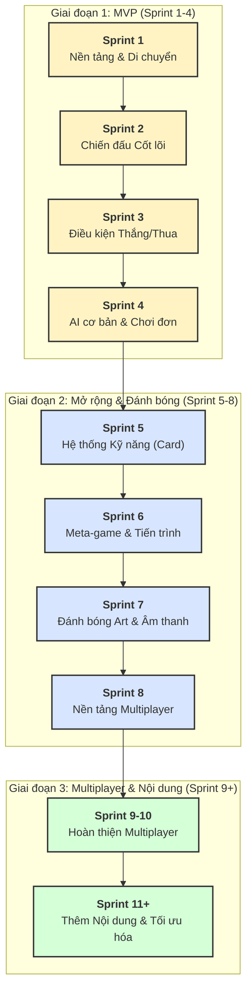

Chào bạn, dựa vào tài liệu GDD bạn cung cấp, tôi đã phác thảo một kế hoạch sprint chi tiết để phát triển game "Shardrealm" (tên dự kiến). Kế hoạch này tập trung vào việc xây dựng một phiên bản Chơi được Cốt lõi (Core Playable) trước, sau đó mở rộng các tính năng.

Mỗi sprint được đề xuất kéo dài 2 tuần.

---

### **Giai đoạn 1: Xây dựng phiên bản MVP (Minimum Viable Product) - (Sprint 1-4)**

Mục tiêu của giai đoạn này là tạo ra một vòng lặp gameplay hoàn chỉnh ở chế độ chơi đơn (Player vs Bot) với các cơ chế cốt lõi.

**Sprint 1: Nền tảng Dự án & Cơ chế Di chuyển**
*   **Mục tiêu:** Thiết lập dự án và hiện thực hóa các tương tác cơ bản nhất trên bản đồ.
*   **Công việc:**
    1.  **Thiết lập dự án:**
        *   Tạo dự án Unity, cấu trúc thư mục (Scripts, Prefabs, Art, Scenes,...).
        *   Tích hợp hệ thống quản lý phiên bản (Git).
    2.  **Tạo Grid Map:**
        *   Phát triển hệ thống bản đồ dạng lưới (grid-based).
        *   Tạo các ô (cell/tile) và logic tọa độ.
        *   Thêm các chướng ngại vật cơ bản.
    3.  **Unit cơ bản:**
        *   Tạo một Prefab cho Unit với các thuộc tính cơ bản (chưa cần HP/Damage).
        *   Hiện thực logic di chuyển của Unit trên grid theo phạm vi cho trước.
    4.  **Hệ thống lượt chơi (Turn-based):**
        *   Xây dựng state machine đơn giản để chuyển lượt giữa Người chơi 1 và Người chơi 2.

**Sprint 2: Vòng lặp Chiến đấu Cốt lõi (Phần 1)**
*   **Mục tiêu:** Thêm các cơ chế chính của việc chiến đấu và quản lý tài nguyên.
*   **Công việc:**
    1.  **Hệ thống MP & Xúc xắc:**
        *   Tạo UI cho điểm MP.
        *   Hiện thực logic tung 2 xúc xắc và cộng điểm vào thanh MP.
        *   Hiện thực logic lựa chọn hành động từ lượt thứ 2 (tung 1 xúc xắc, không tung).
    2.  **Spawn Unit:**
        *   Hiện thực hành động "spawn unit" tiêu tốn MP.
        *   Unit được tạo ra tại các vị trí hợp lệ (ví dụ: gần thành trì).
    3.  **Chiến đấu cơ bản:**
        *   Thêm thuộc tính HP và Damage cho Unit.
        *   Hiện thực hành động tấn công cơ bản giữa các unit.
        *   Unit bị tiêu diệt khi HP <= 0.

**Sprint 3: Điều kiện Thắng/Thua & Hoàn thiện Gameplay**
*   **Mục tiêu:** Hoàn thành vòng lặp gameplay với mục tiêu và điều kiện kết thúc trận đấu.
*   **Công việc:**
    1.  **Hệ thống Cứ điểm (Strategic Points):**
        *   Tạo Prefab cho "Cứ điểm".
        *   Đặt ngẫu nhiên các cứ điểm lên bản đồ khi bắt đầu trận đấu.
        *   Hiện thực logic chiếm cứ điểm khi Unit di chuyển vào.
    2.  **Điều kiện Thắng/Thua:**
        *   Xây dựng hệ thống kiểm tra liên tục trạng thái các cứ điểm.
        *   Kích hoạt màn hình "Thắng" hoặc "Thua" khi một người chơi chiếm được tất cả cứ điểm.
    3.  **Hệ thống Thời gian theo lượt:**
        *   Hiện thực công thức tính thời gian: `(số unit * 10) + 20s`.
        *   Tự động kết thúc lượt nếu hết giờ.

**Sprint 4: AI cơ bản & Chế độ Chơi đơn**
*   **Mục tiêu:** Tạo ra một đối thủ máy để người chơi có thể trải nghiệm game một mình.
*   **Công việc:**
    1.  **Phát triển AI (Bot):**
        *   Tạo AI có khả năng thực hiện các hành động cơ bản: tung xúc xắc, spawn unit, di chuyển unit đến cứ điểm gần nhất, và tấn công unit của người chơi trong tầm.
    2.  **Luồng Game hoàn chỉnh:**
        *   Tạo các Scene: Main Menu, Game, End Screen (thắng/thua).
        *   Thêm các nút UI để bắt đầu trận đấu với Bot và chơi lại.
    3.  **Giao diện Người dùng (UI) cơ bản:**
        *   Hiển thị HP của unit, thông báo lượt của ai, số MP hiện có.

---

### **Giai đoạn 2: Mở rộng Tính năng & Đánh bóng (Sprint 5-8)**

Mục tiêu là thêm chiều sâu cho gameplay, cải thiện trải nghiệm người dùng và chuẩn bị cho multiplayer.

**Sprint 5: Hệ thống Kỹ năng (Skill Card)**
*   **Mục tiêu:** Thêm một lớp chiến thuật mới thông qua các kỹ năng đặc biệt.
*   **Công việc:**
    1.  **Nền tảng Hệ thống Card:**
        *   Tạo cấu trúc dữ liệu (ScriptableObject) cho Skill Card (Tên, Mô tả, Chi phí MP, Hiệu ứng).
        *   Tạo UI để hiển thị các thẻ bài kỹ năng trên tay người chơi.
    2.  **Hiện thực Skill:**
        *   Tạo 2-3 kỹ năng đơn giản (ví dụ: gây sát thương trực tiếp, hồi máu cho unit, tăng tầm di chuyển).
        *   Hiện thực logic sử dụng skill (tiêu tốn MP, áp dụng hiệu ứng).
    3.  **Tích hợp vào Lựa chọn Hành động:**
        *   Thêm lựa chọn "sử dụng skill" vào các hành động trong lượt.

**Sprint 6: Meta-game & Tiến trình Người chơi**
*   **Mục tiêu:** Xây dựng hệ thống giữ chân người chơi sau mỗi trận đấu.
*   **Công việc:**
    1.  **Hệ thống Kinh tế:**
        *   Trao thưởng Gold và EXP cho người chơi sau mỗi trận đấu.
    2.  **Hệ thống Cấp độ (Level):**
        *   Người chơi lên cấp khi đủ EXP.
        *   Hiện thực logic mở khóa unit mới hoặc skill card mới khi đạt cấp độ nhất định.
    3.  **Lưu trữ Dữ liệu:**
        *   Lưu lại tiến trình của người chơi (cấp độ, lượng gold, các unit/skill đã mở khóa).

**Sprint 7: Đánh bóng Hình ảnh & Âm thanh**
*   **Mục tiêu:** Nâng cao trải nghiệm nghe nhìn.
*   **Công việc:**
    1.  **Tích hợp Art:**
        *   Thay thế các art placeholder bằng model/sprite chính thức (nếu có) cho unit, map, UI.
        *   Thêm hiệu ứng hình ảnh (VFX) cho các hành động: tấn công, tung xúc xắc, chiếm cứ điểm, sử dụng skill.
    2.  **Tích hợp Âm thanh:**
        *   Thêm nhạc nền cho Main Menu và trận đấu.
        *   Thêm hiệu ứng âm thanh (SFX) cho các tương tác quan trọng.
    3.  **Cải thiện UI/UX:**
        *   Tinh chỉnh lại HUD trong trận đấu cho trực quan và dễ hiểu hơn.

**Sprint 8: Nền tảng Multiplayer**
*   **Mục tiêu:** Chuẩn bị kiến trúc kỹ thuật cho chế độ chơi mạng.
*   **Công việc:**
    1.  **Lựa chọn Giải pháp Mạng:**
        *   Nghiên cứu và chọn một giải pháp (ví dụ: Unity Netcode for GameObjects, Photon).
    2.  **Đồng bộ hóa cơ bản:**
        *   Hiện thực đồng bộ hóa trạng thái trận đấu cơ bản: vị trí unit, lượt chơi.
    3.  **Tạo phòng chờ (Lobby):**
        *   Xây dựng hệ thống tìm trận và kết nối 2 người chơi với nhau.

---

### **Giai đoạn 3: Phát triển Multiplayer & Nội dung Mở rộng (Sprint 9+)**

*   **Sprint 9-10: Hoàn thiện Chế độ Multiplayer:**
    *   Đồng bộ hóa tất cả các hành động (sử dụng skill, tung xúc xắc, tính giờ).
    *   Xử lý các trường hợp mất kết nối, đầu hàng.
    *   Kiểm thử và sửa lỗi chuyên sâu cho chế độ mạng.
*   **Sprint 11+: Thêm Nội dung & Tối ưu hóa:**
    *   Thêm nhiều loại Unit và Skill Card mới.
    *   Phát triển hệ thống Shop và các vật phẩm trang trí (theo GDD).
    *   Triển khai Battle Pass.
    *   Cân bằng lại game dựa trên phản hồi.
    *   Tối ưu hóa cho các nền tảng mục tiêu (Android, Steam).

---

### **Kế hoạch Sprint dưới dạng Sơ đồ**

