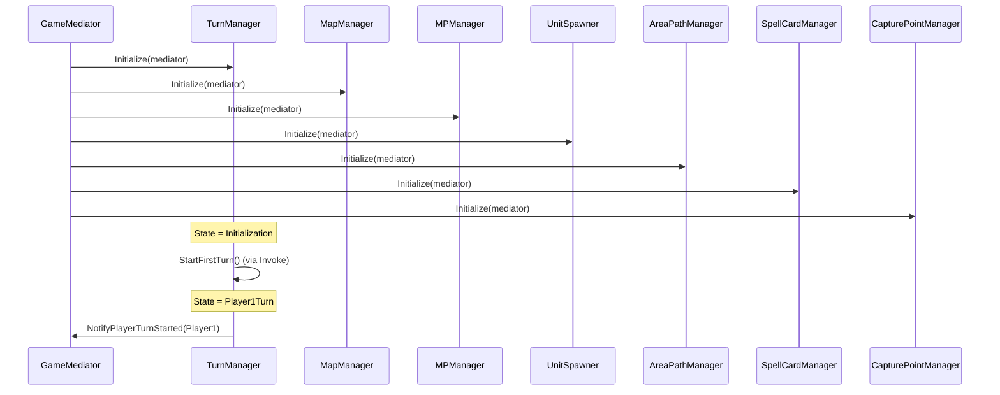
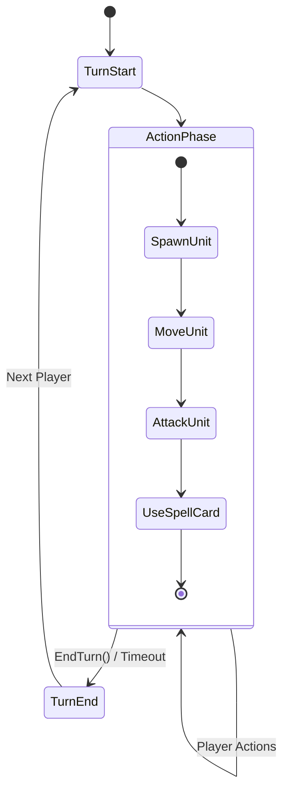
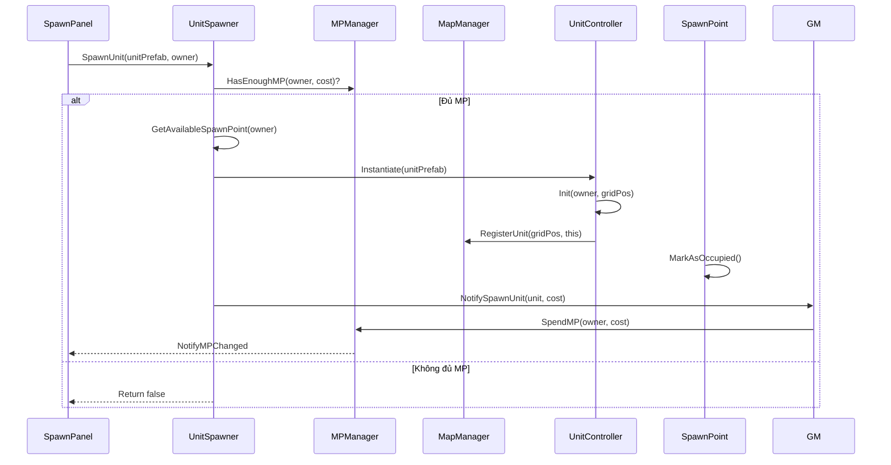
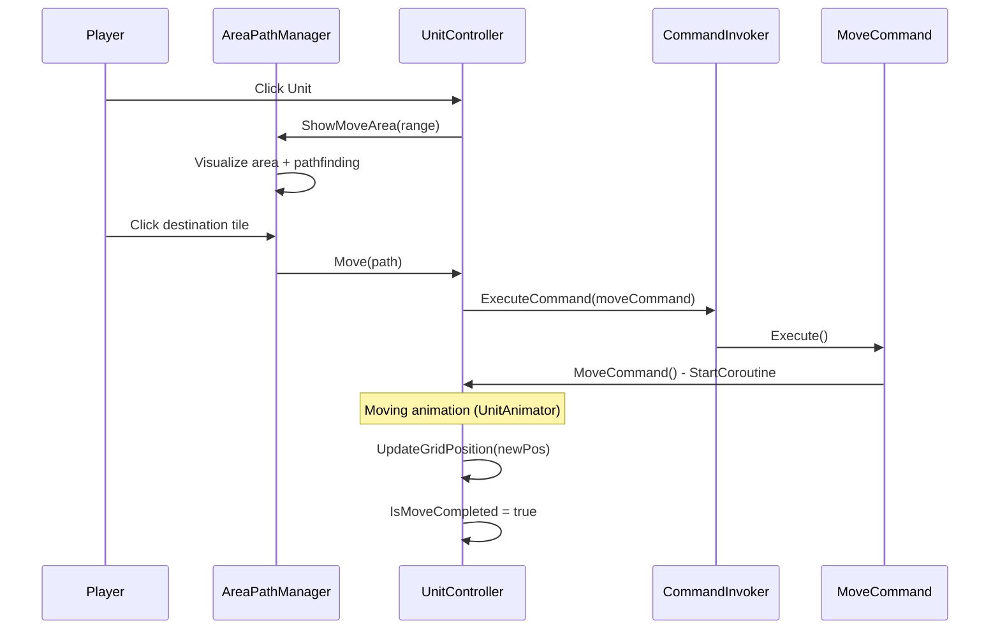
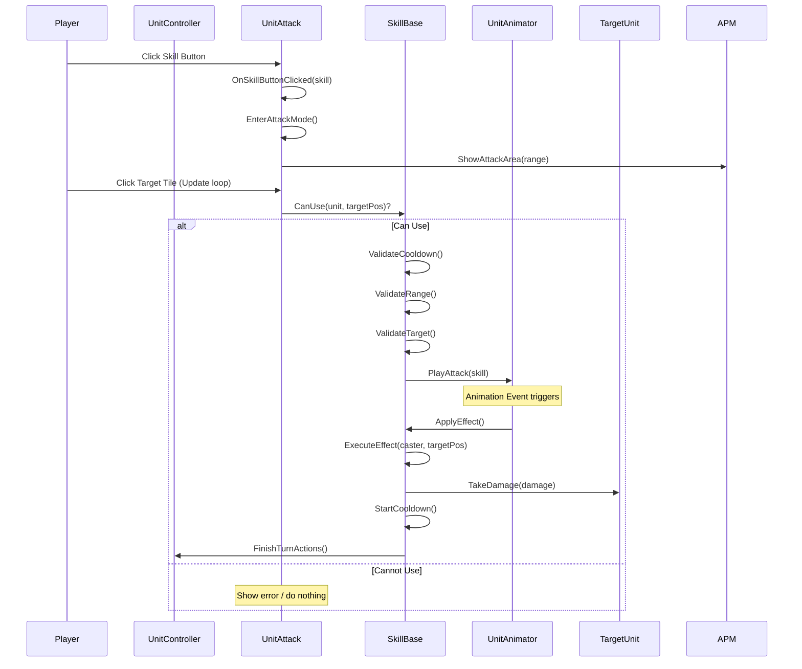
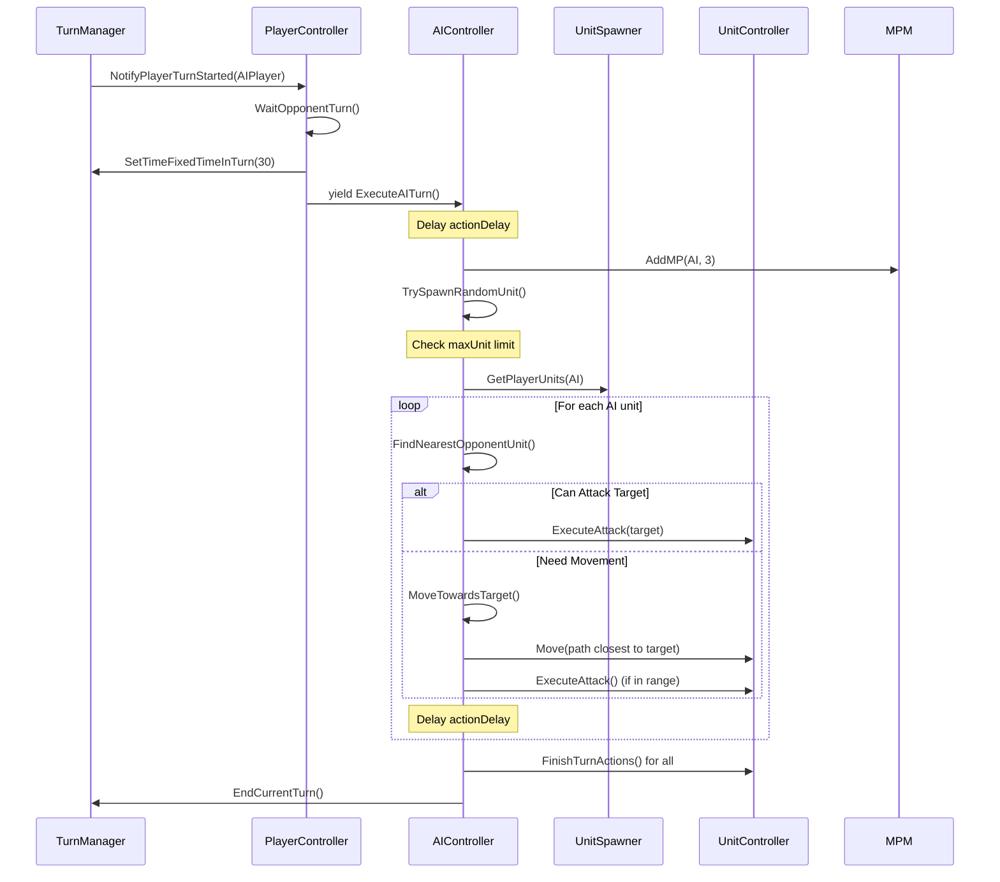
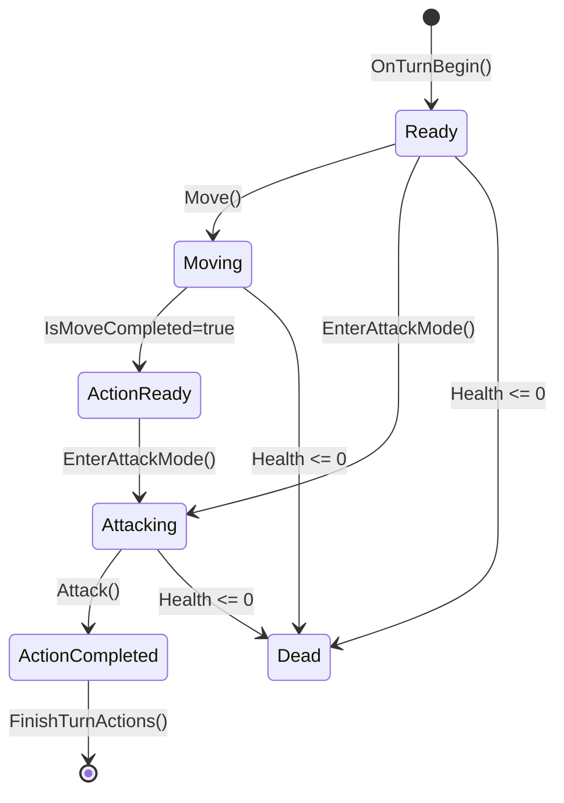
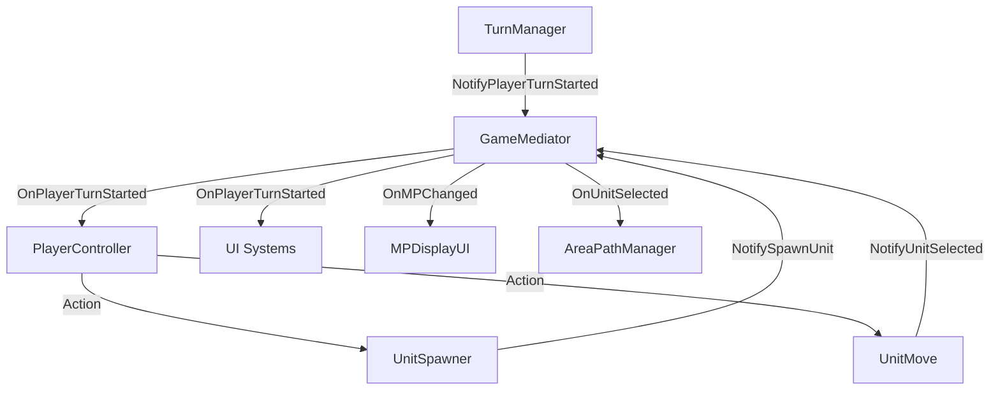

# Core Gameloop System Documentation

## 📋 Tổng quan

Hệ thống Core Gameloop quản lý vòng lặp trò chơi chính trong game Turn-Based Strategy, điều phối các phase của trận đấu từ khởi tạo đến kết thúc. Hệ thống được xây dựng theo kiến trúc modular với các design patterns để dễ bảo trì và mở rộng.

### Phiên bản
- **Version**: 2.0
- **Last Updated**: 2026-03-24
- **Engine**: Unity 2022.3+

---

## 🏗️ Kiến trúc hệ thống

### Sơ đồ tổng quan

```
┌─────────────────────────────────────────────────────────────┐
│                      GAME MEDIATOR                          │
│             (Mediator Pattern - Event Bus)                  │
│  OnPlayerTurnStarted, OnPlayerTurnEnded, OnMPChanged,      │
│  OnUnitSelected, OnUnitDeselected, OnUnitMoved,            │
│  OnCapturePointCaptured, OnGameEnd, OnSpellCardUsed,       │
│  OnHandChanged                                             │
└─────────────────┬───────────────────────────────────────────┘
                  │
        ┌─────────┴──────────┐
        │                    │
        ▼                    ▼
┌──────────────┐    ┌──────────────────┐
│ TurnManager  │    │  PlayerController│
│ (FSM)        │◄───┤  (Input/Logic)   │
└──────┬───────┘    └────────┬─────────┘
       │                     │
       │              ┌──────┴──────┐
       │              ▼             ▼
       │       ┌────────────┐ ┌──────────────┐
       │       │AIController│ │ SpellCard    │
       │       │(Strategy)  │ │ Manager      │
       │       └────────────┘ └──────────────┘
       │
       ├──────────────┬────────────────┬──────────────┬──────────────┐
       ▼              ▼                ▼              ▼              ▼
┌──────────┐   ┌──────────┐    ┌──────────┐   ┌──────────┐  ┌────────────┐
│MPManager │   │MapManager│    │UnitSpawner│   │AreaPath  │  │CapturePoint│
│(Resource)│   │(Grid Sys)│    │(Factory)  │   │Manager   │  │Manager     │
└──────────┘   └──────────┘    └──────────┘   └──────────┘  └────────────┘
```

### Core Components

| Component | Pattern | Trách nhiệm |
|-----------|---------|-------------|
| **GameMediator** | Mediator | Trung gian giao tiếp giữa các manager, giảm coupling |
| **TurnManager** | State Machine | Quản lý states và điều phối turn flow |
| **PlayerController** | Controller | Xử lý input, logic cho người chơi, quản lý AI |
| **AIController** | Strategy | Điều khiển hành vi AI |
| **MPManager** | Singleton | Quản lý tài nguyên MP cho cả 2 player |
| **MapManager** | Spatial Index | Quản lý grid map, tracking units theo vị trí |
| **UnitSpawner** | Factory | Spawn và quản lý units |
| **AreaPathManager** | Visualization | Visualize movement/attack/spell area và pathfinding |
| **CapturePointManager** | Singleton | Quản lý điểm chiếm đóng (victory condition) |
| **ObjectPoolManager** | Object Pool | Object pooling cho VFX, skill buttons, etc. |

---

## 🔄 Gameloop Flow

### 1. Initialization Phase



**Các bước thực hiện:**

1. **GameMediator.Start()**
   - Khởi tạo tất cả managers theo thứ tự qua `Initialize(mediator)`
   - Mỗi manager nhận reference đến GameMediator
   - Setup event subscriptions

2. **TurnManager.Initialize()**
   - Set `turnCount = 0`
   - Set `currentPlayer = StartingPlayer`
   - Change state → `TurnState.Initialization`
   - `Invoke(StartFirstTurn)` để chuyển sang turn đầu tiên

3. **MPManager.Initialize()**
   - Reset MP của cả 2 players về `startingMP`
   - Notify UI cập nhật MP display qua `NotifyMPChanged()`

4. **MapManager.Awake()**
   - Khởi tạo `MapEntity` từ `MapSettings` và `MapView`
   - Initialize grid visualization
   - Initialize `_unitPositions` dictionary

5. **UnitSpawner.Initialize()**
   - Tìm và phân loại `SpawnPoint` theo owner
   - Initialize unit tracking dictionaries
   - SpawnPoints subscribe vào `OnUnitMoved` event

6. **AreaPathManager.Initialize()**
   - `EnsureCreated()` spawn area/path prefab instances
   - Cache map reference

### 2. Turn Loop

Mỗi turn bao gồm 3 phases chính:



#### 2.1. Turn Start Phase

**TurnManager.StartPlayerTurn(PlayerID player)**

```csharp
private void StartPlayerTurn(PlayerID player)
{
    currentPlayer = player;
    turnCount++;
    _gameMediator.NotifyPlayerTurnStarted(currentPlayer);
}
```

**PlayerController.HandleTurnStarted()**

```csharp
private IEnumerator OnMyTurnStarted()
{
    // 1. Reset action lefts
    _actionLefts.Value = 2;
    
    // 2. Lấy danh sách units của player
    _myUnits = UnitSpawner.Instance.GetPlayerUnits(playerID);
    
    // 3. Reset trạng thái của tất cả units
    foreach (var unit in _myUnits)
    {
        unit.OnTurnBegin();
        // → ReduceSkillsCooldowns()
        // → _buffHandler.TickEffects() (apply Burn/Poison, giảm duration)
        // → ResetComponents() (IsMoveCompleted, IsActionCompleted = false)
    }
    
    // 4. Tính thời gian cho lượt
    TurnManager.Instance.CalculateTimeLimitInTurn(_myUnits.Count);
    // Timer = _flatTimeLimit + unitCount * 10
}
```

**Key Actions:**
- Increment `turnCount`
- Reset unit states: `IsMoveCompleted = false`, `IsActionCompleted = false`
- Reduce skill cooldowns: `ReduceSkillsCooldowns()`
- Tick status effects: `BuffDebuffHandler.TickEffects()` (Burn/Poison damage, duration giảm)
- Calculate turn timer: `flatTime + (unitCount × 10)`
- Trigger event: `OnPlayerTurnStarted`

#### 2.2. Action Phase

Player có thể thực hiện các actions sau trong lượt:

##### A. Spawn Unit Action



**Flow:**
1. Player click spawn button trong UI
2. `UnitSpawner.SpawnUnit()` kiểm tra:
   - Có đủ MP không? (`MPManager.HasEnoughMP()`)
   - Có spawn point available không?
3. Nếu hợp lệ:
   - Instantiate unit prefab
   - `unit.Init(owner, startGridPos)`
   - Register vào `MapManager._unitPositions`
   - Trừ MP: `MPManager.SpendMP()`
4. Add unit vào `playerUnits[owner]` list

##### B. Movement Action



**Chi tiết Implementation:**

**UnitController.Move()** - Nhận path và callback
```csharp
public void Move(List<TileEntity> path, Action onComplete = null)
{
    _tempPath = path;
    OnCompleteMove = onComplete;
    _commandInvoker.ExecuteCommand(_moveCommand); // Command Pattern
}
```

**MoveCommand.Execute()** - Command Pattern
```csharp
public class MoveCommand : ICommand
{
    private readonly UnitController _unit;
    private Vector3Int _previousPosition;

    public void Execute()
    {
        _previousPosition = _unit.currentGridPosition;
        _unit.MoveCommand();
    }
    
    public void Undo()
    {
        _unit.UndoMoveAction(_previousPosition);
    }
}
```

**UnitController.Moving()** - Coroutine di chuyển
```csharp
IEnumerator Moving(List<TileEntity> path)
{
    // UnitAnimator.StartMoving()
    foreach (var tile in path)
    {
        // Smooth movement với lerp
        while (!reached)
        {
            transform.position += stepDir * Time.deltaTime;
            yield return null;
        }
    }
    // UnitAnimator.StopMoving()
    
    // Cập nhật vị trí mới trên MapManager
    UpdateGridPosition(path[path.Count - 1].Position);
    // → MapManager.UnregisterUnit(oldPos)
    // → MapManager.RegisterUnit(newPos, this)
    // → GameMediator.NotifyUnitMoved(this, oldPos, newPos)
    IsMoveCompleted = true;
    OnCompleteMove?.Invoke();
}
```

**Command Pattern Benefits:**
- Undo movement: Cancel Move button → `UndoLastCommand()`
- Potential replay system
- Action history tracking

##### C. Attack Action



**Skill System - Strategy + Template Method Pattern:**

```csharp
public interface ISkill
{
    string SkillName { get; }
    string Description { get; }
    SkillType Type { get; }
    Sprite Icon { get; }
    int Range { get; }
    int Cooldown { get; }
    int CurrentCooldown { get; }
    
    bool CanUse(UnitController caster, Vector3Int targetPos);
    void Execute(UnitController caster, Vector3Int targetPos);
    List<Vector3Int> GetAffectedTiles(Vector3Int targetPos);
    void ResetCooldown();
    void ReduceCooldown();
    ISkill Clone();
}

public enum SkillType
{
    Normal,          // Không cooldown
    Active,          // Cast thủ công
    Passive,         // Auto-trigger
    Ultimate,        // Ultimate ability
    BuffAndDebuff,   // Status effects
}

[Flags]
public enum TargetType
{
    None = 0,
    Ally = 1 << 0,      // Target đồng minh
    Enemy = 1 << 1,     // Target kẻ địch
    Self = 1 << 2,      // Target bản thân
    EmptyTile = 1 << 3, // Target tile trống
}
```

**SkillBase (ScriptableObject) - Template Method:**
```csharp
public abstract class SkillBase : ScriptableObject, ISkill
{
    [SerializeField] protected string skillName;
    [SerializeField] protected SkillType skillType;
    [SerializeField] protected int cooldown, range;
    [SerializeField] protected TargetType targetTypes;
    public GameObject VfxPrefab, VfxHitPrefab;
    public bool HasDelayApplyEffect;
    public float DelayApplyEffectTime;

    // Template Method: validation pipeline
    public virtual bool CanUse(UnitController caster, Vector3Int targetPos)
    {
        return ValidateCooldown()
            && ValidateRange(caster, targetPos)
            && ValidateTarget(caster, targetPos)
            && ValidateCustomConditions(caster, targetPos);
    }

    // Execute → animation → animation event → ApplyEffect() → ExecuteEffect()
    public void Execute(UnitController caster, Vector3Int targetPos);
    protected abstract void ExecuteEffect(UnitController caster, Vector3Int targetPos);
    protected abstract List<Vector3Int> GetAffectedTiles(Vector3Int targetPos);
}
```

**Các loại Skills:**
- **NormalAttackSkill**: Basic attack, no cooldown, `BaseDamage × multipleDmg`
- **FireballSkill**: AOE damage, cooldown, `aoeRadius` tiles, skip target validation (hit empty)
- **HealSkill**: Heal target ally, cooldown, `BaseDamage × multiple`

**Attack Flow:**
1. Player click skill button → `UnitAttack.OnSkillButtonClicked(skill)`
2. `EnterAttackMode()`: Show attack area, dim action panel
3. `UnitAttack.Update()` lắng nghe click target tile
4. Check `skill.CanUse()` (Template Method pipeline):
   - `ValidateCooldown()` — skill off cooldown? (Normal type bypass)
   - `ValidateRange()` — target in range?
   - `ValidateTarget()` — target type matches? (Ally/Enemy/Self/EmptyTile flags)
   - `ValidateCustomConditions()` — custom logic (e.g., HealSkill: target alive & not full HP)
5. `skill.Execute()` → start async execution:
   - `caster.PerformSkill(skill, targetPos)` — face target, play attack animation
   - `StartCooldown()` — set cooldown
   - Wait for `ApplyEffect()` từ animation event (max 10s timeout)
   - `ExecuteEffect()` — apply damage/heal
   - `OnExecuteComplete()` → `SkillEventBus.OnSkillUsed` + `caster.FinishTurnActions()`

#### 2.3. Turn End Phase

**Kết thúc lượt bằng 2 cách:**

1. **Manual End Turn:**
```csharp
EndTurnButton.onClick.AddListener(() => 
{
    TurnManager.Instance.EndCurrentTurn();
});
```

2. **Timeout:**
```csharp
void Update()
{
    if (!_isTriggerTimer) return;
    
    Timer -= Time.deltaTime;
    if (Timer <= 0)
    {
        EndCurrentTurn();
    }
}
```

**TurnManager.EndCurrentTurn() Sequence:**

```csharp
public void EndCurrentTurn()
{
    _isTriggerTimer = false;
    
    // 1. Notify turn ended
    _gameMediator.NotifyPlayerTurnEnded(currentPlayer);
    
    // 2. Switch to next player after delay
    Invoke(nameof(SwitchToNextPlayer), TurnTransitionDelay);
}
```

**PlayerController.OnMyTurnEnded():**
```csharp
private IEnumerator OnMyTurnEnded()
{
    foreach (var unit in _myUnits)
    {
        unit.FinishTurnActions();
        // - Set IsMoveCompleted = true
        // - Set IsActionCompleted = true
        // - Exit attack mode
        // - Deselect unit
        // - Reset AreaPathManager
    }
}
```

**Turn Transition:**
```csharp
private void SwitchToNextPlayer()
{
    if (currentState == TurnState.Player1Turn)
        ChangeState(TurnState.Player2Turn);
    else if (currentState == TurnState.Player2Turn)
        ChangeState(TurnState.Player1Turn);
}
```

### 3. AI Turn

AI có turn riêng, được gọi từ `PlayerController.WaitOpponentTurn()`:



**AIController.ExecuteAITurn() Flow:**

```csharp
public IEnumerator ExecuteAITurn()
{
    yield return new WaitForSeconds(actionDelay);
    
    // 1. Cộng MP mỗi lượt
    MPManager.Instance.AddMP(aiPlayerID, 3);
    
    // 2. Thử spawn random unit (kiểm tra maxUnit)
    bool spawned = TrySpawnRandomUnit();
    if (spawned) yield return new WaitForSeconds(actionDelay);
    
    // 3. Lấy tất cả AI units
    var myUnits = UnitSpawner.Instance.GetPlayerUnits(aiPlayerID);
    
    // 4. Với mỗi unit, thực hiện action
    foreach (var unit in myUnits)
    {
        yield return StartCoroutine(ExecuteUnitAction(unit));
        yield return new WaitForSeconds(actionDelay);
    }
    
    // 5. Finish tất cả units và end turn
    foreach (var unit in myUnits)
        unit.FinishTurnActions();
        
    TurnManager.Instance.EndCurrentTurn();
}
```

**AI Decision Logic:**

```csharp
private IEnumerator ExecuteUnitAction(UnitController unit)
{
    // 1. Tìm target gần nhất
    var targetUnit = FindNearestOpponentUnit(unit);
    if (targetUnit == null) yield break;
    
    // 2. Kiểm tra có thể tấn công không
    if (CanAttackTarget(unit, targetUnit))
    {
        yield return StartCoroutine(AttackTarget(unit, targetUnit));
    }
    else
    {
        // 3. Di chuyển về phía target (tìm tile gần target nhất trong move range)
        yield return StartCoroutine(MoveTowardsTarget(unit, targetUnit));
        
        // 4. Tấn công sau khi di chuyển (nếu có thể)
        if (CanAttackTarget(unit, targetUnit))
            yield return StartCoroutine(AttackTarget(unit, targetUnit));
    }
}
```

**AIController Settings:**
```csharp
[SerializeField] List<UnitController> availableUnits;  // Pool AI units
[SerializeField] float actionDelay = 1f;                // Delay giữa actions
[SerializeField] int maxUnit = 3;                        // Giới hạn unit trên bàn
```

**AI Features:**
- Spawn random unit nếu có đủ MP và chưa đạt `maxUnit`
- `Initialize(PlayerID mainPlayer)` → set `aiPlayerID` = opposite of main player
- Tìm target gần nhất bằng distance calculation
- Di chuyển về phía target: tìm tile walkable gần target nhất trong move range
- Tấn công khi trong range qua `UnitAttack.CanAttack()` / `ExecuteAttack()`
- Có action delay giữa mỗi hành động

### 4. Game End Condition

```csharp
// Thông qua GameMediator
GameMediator.Instance.NotifyGameEnd(winnerPlayer);
// → TurnManager.TriggerGameEnd(winner)
// → ChangeState(TurnState.GameEnd)
// → OnGameEnd?.Invoke(winner)
```

**TurnManager.TriggerGameEnd():**
```csharp
public void TriggerGameEnd(PlayerID winner)
{
    _winner = winner;
    CancelInvoke();  // Cancel pending SwitchToNextPlayer
    ChangeState(TurnState.GameEnd);
}
```

**Điều kiện kết thúc:**
- Khi 1 player hết units hoặc CapturePoint bị chiếm
- `GameMediator` gọi `NotifyGameEnd(winner)` → `TurnManager.TriggerGameEnd()`

---

## 🎯 State Management

### Turn States

```csharp
public enum TurnState
{
    Initialization,     // Khởi tạo game
    Player1Turn,        // Lượt Player 1
    Player2Turn,        // Lượt Player 2
    GameEnd            // Kết thúc trận đấu
}
```

### Unit States

Mỗi unit có các state flags trong `UnitRuntimeStats` (nested class trong `UnitController`):

```csharp
public class UnitRuntimeStats
{
    public int Health;                   // Current HP
    public int MaxHealth;                // Max HP
    public int BaseDamage;               // Base damage
    public int MoveRange;                // Movement range
    public MapEntity MapEntity;          // Map reference
    public PlayerID Owner;               // Unit owner
    public Action OnFinishTurn;          // Callback
    public bool IsInAttackMode;          // Đang ở chế độ attack
    public bool IsMoveCompleted;         // Đã di chuyển xong
    public bool IsActionCompleted;       // Đã hoàn thành action
    public bool IsDead;                  // Unit đã chết
}
```

**State Transitions:**



**Unit State Checks:**

```csharp
// Có thể di chuyển?
public bool CanMove() => 
    !IsMoveCompleted && !IsInAttackMode 
    && !(_buffHandler != null && _buffHandler.IsRooted());

// Có thể tấn công?
public bool CanAttack() => 
    !IsActionCompleted;

// Action hoàn tất?
public bool IsActionFinished() => 
    IsActionCompleted;
```

---

## 🎨 Design Patterns

### 1. Mediator Pattern - GameMediator

**Vấn đề:** Managers cần giao tiếp với nhau nhưng không muốn phụ thuộc trực tiếp.

**Giải pháp:** GameMediator làm trung gian, các manager chỉ biết về Mediator.

```csharp
public class GameMediator : MonoBehaviour
{
    // Serialized References
    [SerializeField] TurnManager turnManager;
    [SerializeField] MPManager mpManager;
    [SerializeField] MapManager mapManager;
    [SerializeField] UnitSpawner unitSpawner;
    [SerializeField] AreaPathManager areaPathManager;
    [SerializeField] CapturePointManager capturePointManager;
    [SerializeField] SpellCardManager spellCardManager;

    // Events
    public event Action<PlayerID> OnPlayerTurnStarted;
    public event Action<PlayerID> OnPlayerTurnEnded;
    public event Action<PlayerID, int, int> OnMPChanged;
    public event Action<UnitController> OnUnitSelected;
    public event Action<UnitController> OnUnitDeselected;
    public event Action<UnitController, Vector3Int, Vector3Int> OnUnitMoved;
    public event Action<Vector3Int, PlayerID> OnCapturePointCaptured;
    public event Action<PlayerID> OnGameEnd;
    public event Action<SpellCardData, PlayerID> OnSpellCardUsed;
    public event Action<PlayerID> OnHandChanged;

    // Notify Methods
    public void NotifyPlayerTurnStarted(PlayerID player);
    public void NotifyPlayerTurnEnded(PlayerID player);
    public void NotifyMPChanged(PlayerID player, int currentMP, int maxMP);
    public void NotifySpawnUnit(UnitController unit, int mpSpent);
    public void NotifyUnitSelected(UnitController unit);
    public void NotifyUnitDeselected(UnitController unit);
    public void NotifyUnitMoved(UnitController unit, Vector3Int oldPos, Vector3Int newPos);
    public void NotifyCapturePointCaptured(Vector3Int position, PlayerID newOwner);
    public void NotifyGameEnd(PlayerID winner);
    public void NotifySpellCardUsed(SpellCardData card, PlayerID caster);
    public void NotifyHandChanged(PlayerID player);
}
```

**Benefits:**
- Giảm coupling giữa managers
- Dễ thêm/sửa events
- Central event bus
- Testable

### 2. Command Pattern - Movement System

**Vấn đề:** Cần undo movement, potential replay system.

**Giải pháp:** Encapsulate action trong Command object.

```csharp
public interface ICommand
{
    void Execute();
    void Undo();
}

public class MoveCommand : ICommand
{
    private UnitMove _receiver;
    private Vector3Int _previousPosition;
    
    public void Execute()
    {
        _previousPosition = _receiver.currentGridPosition;
        _receiver.MoveCommand();
    }
    
    public void Undo()
    {
        _receiver.UndoMoveAction(_previousPosition);
    }
}

public class CommandInvoker
{
    private Stack<ICommand> _commandHistory = new Stack<ICommand>();
    
    public void ExecuteCommand(ICommand command)
    {
        command.Execute();
        _commandHistory.Push(command);
    }
    
    public void UndoLastCommand()
    {
        if (_commandHistory.Count > 0)
        {
            var command = _commandHistory.Pop();
            command.Undo();
        }
    }
}
```

**Usage:**
```csharp
// In UnitMove
_cancelMoveButton.onClick.AddListener(() =>
{
    _commandInvoker.UndoLastCommand();
});
```

### 3. Strategy Pattern - Skill System

**Vấn đề:** Mỗi skill có logic khác nhau, cần dễ thêm skills mới.

**Giải pháp:** Strategy interface cho skills.

```csharp
public interface ISkill
{
    string SkillName { get; }
    int Range { get; }
    int Cooldown { get; }
    int CurrentCooldown { get; }
    
    bool CanUse(UnitMove caster, Vector3Int targetPos);
    void Execute(UnitMove caster, Vector3Int targetPos);
    ISkill Clone();
}

// Concrete Strategy
public class FireballSkill : SkillBase
{
    public override bool CanUse(UnitMove caster, Vector3Int targetPos)
    {
        if (CurrentCooldown > 0) return false;
        
        var distance = MapManager.Instance.GetDistance(
            caster.currentGridPosition, targetPos);
        
        return distance <= Range;
    }
    
    public override void Execute(UnitMove caster, Vector3Int targetPos)
    {
        // AOE damage logic
        var affectedTiles = GetAOETiles(targetPos, aoeRadius);
        foreach (var tile in affectedTiles)
        {
            var unit = MapManager.Instance.GetUnitAtTile(tile);
            if (unit != null && unit.GetOwner() != caster.GetOwner())
            {
                unit.TakeDamage(baseDamage);
            }
        }
        
        SetCooldown(maxCooldown);
        SpawnVFX(targetPos);
    }
}
```

**Benefits:**
- Dễ thêm skills mới: chỉ cần implement `ISkill`
- Skills độc lập với nhau
- Runtime skill switching
- Cooldown management tự động

### 4. State Pattern - TurnManager

**Giải pháp:** Finite State Machine cho game states.

```csharp
public class TurnManager
{
    private TurnState currentState;
    
    private void ChangeState(TurnState newState)
    {
        if (currentState == newState) return;
        
        // Exit current state
        ExitState(currentState);
        
        // Enter new state
        currentState = newState;
        HandleStateChange(newState);
    }
    
    private void HandleStateChange(TurnState state)
    {
        switch (state)
        {
            case TurnState.Initialization:
                // Setup game
                break;
            case TurnState.Player1Turn:
                StartPlayerTurn(PlayerID.Player1);
                break;
            // ...
        }
    }
}
```

### 5. Singleton Pattern - Managers

**Why:** Chỉ cần 1 instance của mỗi manager, global access.

```csharp
public class MPManager : BaseManager
{
    public static MPManager Instance { get; private set; }
    
    private void Awake()
    {
        if (Instance != null && Instance != this)
        {
            Destroy(gameObject);
            return;
        }
        Instance = this;
    }
}
```

**All Singletons:**
- TurnManager
- MapManager
- MPManager
- UnitSpawner
- AreaPathManager
- GameMediator

### 6. Factory Pattern - UnitSpawner

**Giải pháp:** Centralized unit creation logic.

```csharp
public class UnitSpawner : BaseManager
{
    public bool SpawnUnit(UnitMove unitPrefab, PlayerID owner, SpawnPoint spawnPoint = null)
    {
        // 1. Validate MP
        if (!MPManager.Instance.HasEnoughMP(owner, unitPrefab.UnitData.ManaCost))
            return false;
        
        // 2. Find spawn point
        if (spawnPoint == null)
            spawnPoint = GetAvailableSpawnPoint(owner);
        
        if (spawnPoint == null)
            return false;
        
        // 3. Create unit
        var newUnit = Instantiate(unitPrefab, spawnPoint.transform.position, 
                                   Quaternion.identity, unitsContainer);
        
        // 4. Initialize unit
        newUnit.Init(owner, spawnPoint.GridPosition);
        
        // 5. Track unit
        playerUnits[owner].Add(newUnit);
        spawnPoint.SetOccupied(true);
        
        // 6. Notify mediator
        _gameMediator.NotifySpawnUnit(newUnit, unitPrefab.UnitData.ManaCost);
        
        return true;
    }
}
```

---

## 📡 Event System

### Event Flow Diagram



### Event Subscriptions

**PlayerController:**
```csharp
private void SubscribeToEvents()
{
    GameMediator.Instance.OnPlayerTurnStarted += HandleTurnStarted;
    GameMediator.Instance.OnPlayerTurnEnded += HandleTurnEnded;
}
```

**MPDisplayUI:**
```csharp
private void Start()
{
    GameMediator.Instance.OnMPChanged += UpdateMPDisplay;
}

private void UpdateMPDisplay(PlayerID player, int current, int max)
{
    if (player == myPlayerID)
    {
        mpText.text = $"{current}/{max}";
        mpSlider.value = (float)current / max;
    }
}
```

### Event Types

| Event | Parameters | Subscribers | Purpose |
|-------|-----------|-------------|---------|
| `OnPlayerTurnStarted` | PlayerID | PlayerController, UI | Trigger turn start logic |
| `OnPlayerTurnEnded` | PlayerID | PlayerController, UI | Clean up turn |
| `OnMPChanged` | PlayerID, current, max | MPDisplayUI | Update MP UI |
| `OnUnitSelected` | UnitMove | AreaPathManager | Show movement area |
| `OnUnitDeselected` | UnitMove | AreaPathManager | Hide areas |

---

## 🔗 Integration Points

### 1. UI System Integration

**Spawn Panel:**
```csharp
public class SpawnUnitButton : MonoBehaviour
{
    private void OnClick()
    {
        bool success = UnitSpawner.Instance.SpawnUnit(
            unitPrefab, 
            PlayerController.CurrentPlayerID
        );
        
        if (!success)
        {
            // Show error message
        }
    }
}
```

**End Turn Button:**
```csharp
EndTurnButton.onClick.AddListener(() =>
{
    TurnManager.Instance.EndCurrentTurn();
});
```

### 2. Input System Integration

**AreaPathManager.Update():**
```csharp
void Update()
{
    if (IsLocked) return;
    
    var mousePos = MyInput.GroundPosition(_cachedMap.Settings.Plane());
    
    if (MyInput.GetOnWorldUp(_cachedMap.Settings.Plane()))
    {
        var tile = _cachedMap.Tile(mousePos);
        if (tile != null && selectedUnit != null)
        {
            HandleWorldClickAndMove(mousePos);
        }
    }
}
```

### 3. Animation System Integration

**UnitAnimator:**
```csharp
public class UnitAnimator : MonoBehaviour
{
    public void StartMoving()
    {
        animator.SetBool("IsMoving", true);
    }
    
    public void PlayAttack(SkillBase skill)
    {
        animator.SetTrigger(skill.AnimationTrigger);
    }
    
    public void PlayHit()
    {
        animator.SetTrigger("Hit");
    }
}
```

### 4. VFX System Integration

**Skill VFX:**
```csharp
public abstract class SkillBase : ISkill
{
    protected void SpawnVFX(Vector3Int targetPos)
    {
        if (vfxPrefab == null) return;
        
        var worldPos = MapManager.Instance.MapEntity.WorldPosition(targetPos);
        var vfx = ObjectPoolManager.Instance.Spawn(vfxPrefab, worldPos);
        
        // VFX tự destroy sau duration
    }
}
```

---

## 🚀 Performance Considerations

### 1. Object Pooling

**VFX Pooling:**
```csharp
public class PooledVFX : MonoBehaviour, IPoolable
{
    [SerializeField] private float lifetime = 2f;
    
    public void OnSpawn()
    {
        Invoke(nameof(ReturnToPool), lifetime);
    }
    
    public void OnDespawn()
    {
        CancelInvoke();
    }
    
    private void ReturnToPool()
    {
        ObjectPoolManager.Instance.Despawn(gameObject);
    }
}
```

### 2. Pathfinding Optimization

**Cache MapEntity:**
```csharp
MapEntity _cachedMap;

public void SetCachedMap(MapEntity map)
{
    _cachedMap = map;
}
```

**Use range limits:**
```csharp
var path = _cachedMap.PathPoints(start, end, maxRange);
// Không tính path xa hơn maxRange
```

### 3. Update Loops

**Conditional Updates:**
```csharp
void Update()
{
    if (!_isMyTurn) return;  // Skip nếu không phải turn mình
    
    if (!runtimeStats.IsInAttackMode) return;  // Skip nếu không attack mode
    
    // Logic chỉ chạy khi cần thiết
}
```

---

## 🧪 Testing & Debugging

### Debug Commands

**TurnManager:**
```csharp
[ContextMenu("Force End Turn")]
private void ForceEndTurn()
{
    EndCurrentTurn();
}

[ContextMenu("Skip To Game End")]
private void SkipToGameEnd()
{
    ChangeState(TurnState.GameEnd);
}
```

**MPManager:**
```csharp
[ContextMenu("Add 10 MP to Player 1")]
private void DebugAddMP()
{
    AddMP(PlayerID.Player1, 10);
}
```

### Logging

**Turn flow logging:**
```csharp
Debug.Log($"=== Turn {turnCount}: Player {(int)player}'s Turn Started ===");
Debug.Log($"=== Player {(int)currentPlayer}'s Turn Ended ===");
```

**Action logging:**
```csharp
Debug.Log($"Player {player} gained {amount} MP. Current: {currentMP}/{maxMP}");
Debug.Log($"AI đã spawn {randomUnit.UnitData.unitName}");
```

---

## 📊 Data Flow Examples

### Example 1: Complete Turn Cycle

```
Turn Start (Player 1)
├── TurnManager.StartPlayerTurn(Player1)
├── GameMediator.NotifyPlayerTurnStarted(Player1)
├── PlayerController.HandleTurnStarted()
│   ├── Reset _actionLefts = 2
│   ├── Get _myUnits from UnitSpawner
│   ├── Call unit.OnTurnBegin() for each unit
│   └── Calculate timer
│
Action Phase
├── Player spawns Archer (cost 5 MP)
│   ├── UnitSpawner.SpawnUnit()
│   ├── MPManager.SpendMP(Player1, 5)
│   └── GameMediator.NotifyMPChanged()
│
├── Player selects Archer
│   ├── AreaPathManager.SelectUnit(archer)
│   └── Show movement area (range 3)
│
├── Player moves Archer
│   ├── AreaPathManager.HandleWorldClickAndMove()
│   ├── UnitMove.Move(path)
│   ├── CommandInvoker.ExecuteCommand(moveCommand)
│   └── IEnumerator Moving() executes
│
└── Player attacks enemy unit
    ├── UnitAttack.EnterAttackMode()
    ├── Player clicks target
    ├── Skill.Execute()
    ├── Enemy.TakeDamage(damage)
    └── IsActionCompleted = true
│
Turn End
├── Player clicks End Turn button
├── TurnManager.EndCurrentTurn()
├── GameMediator.NotifyPlayerTurnEnded(Player1)
├── PlayerController.OnMyTurnEnded()
│   └── Call unit.FinishTurnActions() for each unit
└── TurnManager.SwitchToNextPlayer() → Player2Turn
```

### Example 2: AI Turn Execution

```
AI Turn Start (Player 2)
├── PlayerController.WaitOpponentTurn()
├── AIController.ExecuteAITurn()
│
AI Actions
├── MPManager.AddMP(Player2, 3)
├── AIController.TrySpawnRandomUnit()
│   └── UnitSpawner.SpawnUnit(randomUnit, Player2)
│
├── For each AI unit:
│   ├── FindNearestOpponentUnit()
│   │   └── Calculate distances to all Player1 units
│   │
│   ├── Decision: Can attack?
│   │   ├── Yes → AttackTarget()
│   │   │   ├── RotationNode.LookAt(target)
│   │   │   ├── UnitAnimator.PlayAttack()
│   │   │   └── Target.TakeDamage()
│   │   │
│   │   └── No → MoveTowardsTarget()
│   │       ├── Calculate path to target
│   │       ├── UnitMove.Move(path)
│   │       └── If in range after move → AttackTarget()
│   │
│   └── Wait actionDelay (1s)
│
AI Turn End
├── Call unit.FinishTurnActions() for all AI units
└── TurnManager.EndCurrentTurn() → Player1Turn
```

---

## 🔧 Configuration

### TurnManager Settings

```csharp
[Header("Turn Settings")]
public PlayerID StartingPlayer = PlayerID.Player1;
public float TurnTransitionDelay = 0.5f;
[SerializeField] private float _flatTimeLimit = 20f;
```

**Turn Timer Formula:**
```
Timer = _flatTimeLimit + (unitCount × 10)
```

### MPManager Settings

```csharp
[Header("MP Settings")]
[SerializeField] private int maxMP = 20;
[SerializeField] private int startingMP = 0;
```

**MP per turn:** AI gets +3 MP at turn start

### AIController Settings

```csharp
[Header("AI Settings")]
[SerializeField] private List<UnitMove> availableUnits;
[SerializeField] private float actionDelay = 1f;
```

---

## 🐛 Common Issues & Solutions

### Issue 1: Units không reset state đầu turn

**Triệu chứng:** Unit vẫn bị đánh dấu `IsActionCompleted` từ turn trước.

**Solution:**
```csharp
public void OnTurnBegin()
{
    _attackComponent.ReduceSkillsCooldowns();
    ResetComponents(); // Gọi function reset states
}

public void ResetComponents()
{
    ResetMove(); // IsMoveCompleted = false, IsActionCompleted = false
    _cancelMoveButton.interactable = false;
}
```

### Issue 2: AI spawn quá nhiều units

**Triệu chứng:** AI spam spawn mỗi turn.

**Solution:** Thêm MP cost validation:
```csharp
private bool TrySpawnRandomUnit()
{
    var randomUnit = availableUnits[Random.Range(0, availableUnits.Count)];
    
    // Check MP trước khi spawn
    if (!MPManager.Instance.HasEnoughMP(aiPlayerID, randomUnit.UnitData.ManaCost))
        return false;
    
    return UnitSpawner.Instance.SpawnUnit(randomUnit, aiPlayerID);
}
```

### Issue 3: Unit movement bị lag khi path dài

**Triệu chứng:** Performance drop khi unit di chuyển xa.

**Solution:** Limit movement range:
```csharp
public int GetMoveRange() => runtimeStats.MoveRange; // e.g., 3-5 tiles max

// In AreaPathManager
var path = _cachedMap.PathPoints(start, end, selectedUnit.GetMoveRange());
```

### Issue 4: Multiple units selected cùng lúc

**Triệu chứng:** Click unit mới nhưng unit cũ vẫn hiển thị area.

**Solution:**
```csharp
public void SelectUnit(UnitMove unit)
{
    if (selectedUnit != null)
    {
        // Deselect unit cũ trước
        selectedUnit.ChangeSelected(false);
        _gameMediator.NotifyUnitDeselected(selectedUnit);
    }
    
    selectedUnit = unit;
    selectedUnit.ChangeSelected(true);
    _gameMediator.NotifyUnitSelected(selectedUnit);
}
```

---

## 📝 Future Enhancements

### Planned Features

1. **Replay System**
   - Sử dụng Command Pattern history
   - Record và playback actions
   - Save/load replay files

2. **Network Multiplayer**
   - Sync turn states qua network
   - Client-server architecture
   - Turn validation server-side

3. **Advanced AI**
   - Behavior Tree cho complex decisions
   - Difficulty levels
   - Strategic unit positioning

4. **Save/Load System**
   - Serialize game state
   - Save mid-game và resume
   - Cloud save support

5. **Tournament Mode**
   - Turn time limits
   - Ranked matches
   - Leaderboard integration

---

## 📚 References

### Related Documentation
- [Grid System Documentation](../Grid_System_Documentation.md)
- [Skill System Documentation](./Skill_System.md) _(pending)_
- [Command Pattern Implementation](./Command_Pattern.md) _(pending)_

### External Resources
- [Unity Coroutines Best Practices](https://docs.unity3d.com/Manual/Coroutines.html)
- [Game Programming Patterns](https://gameprogrammingpatterns.com/)
- [Turn-Based Strategy Design](https://www.gamedeveloper.com/design/turn-based-strategy-guide)

---

## 👥 Contributors

- **System Design**: [Your Name]
- **Implementation**: [Your Team]
- **Documentation**: GitHub Copilot

---

**Last Updated:** 2025-02-11  
**Version:** 1.0  
**Status:** ✅ Production Ready
