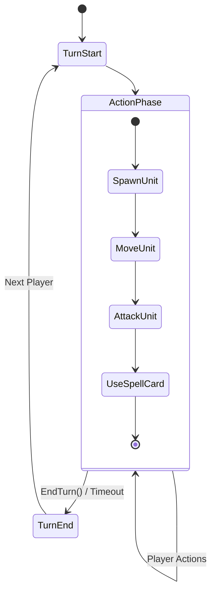
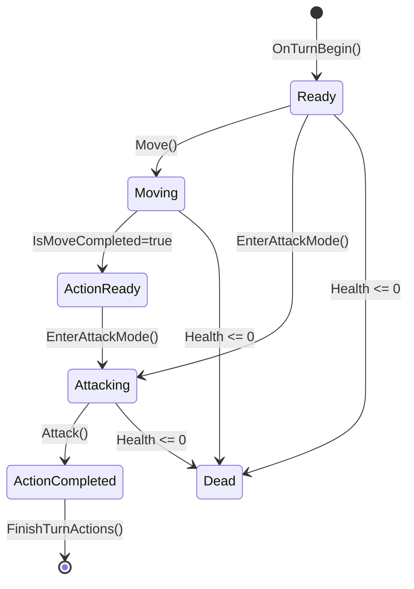
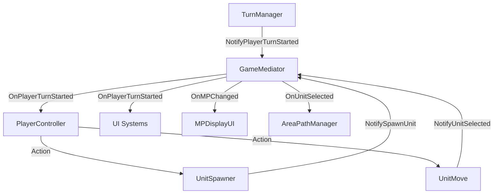

# Core Gameloop System Documentation

- **Version**: 2.0 | **Updated**: 2026-03-24 | **Engine**: Unity 2022.3+

---

## Kiến trúc hệ thống

```
┌─────────────────────────────────────────────────────────────┐
│                      GAME MEDIATOR                          │
│             (Mediator Pattern - Event Bus)                  │
│  OnPlayerTurnStarted, OnPlayerTurnEnded, OnMPChanged,      │
│  OnUnitSelected, OnUnitDeselected, OnUnitMoved,            │
│  OnCapturePointCaptured, OnGameEnd, OnSpellCardUsed,       │
│  OnHandChanged                                             │
└─────────────────┬───────────────────────────────────────────┘
                  │
        ┌─────────┴──────────┐
        │                    │
        ▼                    ▼
┌──────────────┐    ┌──────────────────┐
│ TurnManager  │    │  PlayerController│
│ (FSM)        │◄───┤  (Input/Logic)   │
└──────┬───────┘    └────────┬─────────┘
       │                     │
       │              ┌──────┴──────┐
       │              ▼             ▼
       │       ┌────────────┐ ┌──────────────┐
       │       │AIController│ │ SpellCard    │
       │       │(Strategy)  │ │ Manager      │
       │       └────────────┘ └──────────────┘
       │
       ├──────────────┬────────────────┬──────────────┬──────────────┐
       ▼              ▼                ▼              ▼              ▼
┌──────────┐   ┌──────────┐    ┌──────────┐   ┌──────────┐  ┌────────────┐
│MPManager │   │MapManager│    │UnitSpawner│   │AreaPath  │  │CapturePoint│
│(Resource)│   │(Grid Sys)│    │(Factory)  │   │Manager   │  │Manager     │
└──────────┘   └──────────┘    └──────────┘   └──────────┘  └────────────┘
```

| Component | Pattern | Trách nhiệm |
|-----------|---------|-------------|
| **GameMediator** | Mediator | Trung gian giao tiếp giữa các manager, giảm coupling |
| **TurnManager** | State Machine | Quản lý states và điều phối turn flow |
| **PlayerController** | Controller | Xử lý input, logic cho người chơi, quản lý AI |
| **AIController** | Strategy | Điều khiển hành vi AI |
| **MPManager** | Singleton | Quản lý tài nguyên MP cho cả 2 player |
| **MapManager** | Spatial Index | Quản lý grid map, tracking units theo vị trí |
| **UnitSpawner** | Factory | Spawn và quản lý units |
| **AreaPathManager** | Visualization | Visualize movement/attack/spell area và pathfinding |
| **CapturePointManager** | Singleton | Quản lý điểm chiếm đóng (victory condition) |
| **ObjectPoolManager** | Object Pool | Object pooling cho VFX, skill buttons, etc. |

---

## Gameloop Flow

### 1. Initialization

`GameMediator.Start()` khởi tạo tất cả managers qua `Initialize(mediator)` → `TurnManager` set state = `Initialization` → `Invoke(StartFirstTurn)` → chuyển sang `Player1Turn`.

### 2. Turn Loop



#### Turn Start
- `TurnManager.StartPlayerTurn()` → increment `turnCount`, fire `OnPlayerTurnStarted`
- `PlayerController`: reset `_actionLefts = 2`, lấy units, gọi `unit.OnTurnBegin()` cho mỗi unit:
  - `ReduceSkillsCooldowns()` → `BuffDebuffHandler.TickEffects()` → `ResetComponents()`
- Timer = `_flatTimeLimit + (unitCount × 10)`

#### Action Phase

**A. Spawn Unit**
- UI → `UnitSpawner.SpawnUnit()` → check MP (`MPManager.HasEnoughMP()`) + spawn point available
- Nếu OK: Instantiate → `unit.Init(owner, gridPos)` → `MapManager.RegisterUnit()` → `MPManager.SpendMP()`

**B. Movement** (Command Pattern — hỗ trợ Undo)
- Click unit → `AreaPathManager.ShowMoveArea(range)` → click tile → `UnitController.Move(path)`
- `CommandInvoker.ExecuteCommand(MoveCommand)` → coroutine di chuyển → `UpdateGridPosition()` → `IsMoveCompleted = true`
- Cancel Move → `CommandInvoker.UndoLastCommand()`

**C. Attack** (Strategy + Template Method)
- Click skill button → `EnterAttackMode()` → show attack area → click target
- `skill.CanUse()` pipeline: `ValidateCooldown()` → `ValidateRange()` → `ValidateTarget()` → `ValidateCustomConditions()`
- `skill.Execute()`: play animation → Animation Event cue → `SkillEffectRunner` → `ApplyEffect()` → `ExecuteEffect()` → `StartCooldown()` → `FinishTurnActions()`

#### Turn End
- Manual: `EndTurnButton` hoặc Timeout (`Timer <= 0`)
- `TurnManager.EndCurrentTurn()` → `NotifyPlayerTurnEnded()` → `SwitchToNextPlayer()` sau delay

### 3. AI Turn

```
AIController.ExecuteAITurn():
1. AddMP(aiPlayerID, 3)
2. TrySpawnRandomUnit() (nếu < maxUnit và đủ MP)
3. Với mỗi unit:
   - FindNearestOpponentUnit()
   - Nếu trong range → AttackTarget()
   - Nếu không → MoveTowardsTarget() → AttackTarget() (nếu đã vào range)
4. FinishTurnActions() cho all units → EndCurrentTurn()
```

### 4. Game End

- Điều kiện: 1 player hết units HOẶC CapturePoint bị chiếm
- `GameMediator.NotifyGameEnd(winner)` → `TurnManager.TriggerGameEnd()` → state = `GameEnd`

---

## State Management

### Turn States

```csharp
public enum TurnState { Initialization, Player1Turn, Player2Turn, GameEnd }
```

### Unit States (`UnitRuntimeStats`)

```csharp
public class UnitRuntimeStats
{
    public int Health, MaxHealth, BaseDamage, MoveRange;
    public PlayerID Owner;
    public bool IsInAttackMode, IsMoveCompleted, IsActionCompleted, IsDead;
}
```



**State Checks:**
- `CanMove()` → `!IsMoveCompleted && !IsInAttackMode && !IsRooted()`
- `CanAttack()` → `!IsActionCompleted`

---

## Design Patterns (tóm tắt)

| Pattern | Áp dụng | Mục đích |
|---------|---------|----------|
| **Mediator** | `GameMediator` | Event bus trung gian, giảm coupling giữa managers |
| **Command** | `MoveCommand` / `CommandInvoker` | Undo movement, action history |
| **Strategy + Template Method** | `ISkill` / `SkillBase` | Skill system mở rộng, validation pipeline chung |
| **State Machine** | `TurnManager` | FSM cho turn flow (`ChangeState` → `HandleStateChange`) |
| **Singleton** | Tất cả managers | Global access, 1 instance duy nhất |
| **Factory** | `UnitSpawner` | Centralized unit creation (validate MP → find spawn → instantiate → register) |
| **Object Pool** | `ObjectPoolManager` | Reuse VFX, skill buttons |

---

## Event System

### Events qua GameMediator

| Event | Parameters | Purpose |
|-------|-----------|---------|
| `OnPlayerTurnStarted` | `PlayerID` | Trigger turn start logic |
| `OnPlayerTurnEnded` | `PlayerID` | Clean up turn |
| `OnMPChanged` | `PlayerID, int, int` | Update MP UI |
| `OnUnitSelected` | `UnitController` | Show movement area |
| `OnUnitDeselected` | `UnitController` | Hide areas |
| `OnUnitMoved` | `UnitController, Vector3Int, Vector3Int` | Track unit position |
| `OnCapturePointCaptured` | `Vector3Int, PlayerID` | Victory condition check |
| `OnGameEnd` | `PlayerID` | End game UI |
| `OnSpellCardUsed` | `SpellCardData, PlayerID` | SpellCard effects |
| `OnHandChanged` | `PlayerID` | Update hand UI |



---

## Skill System

```csharp
public interface ISkill
{
    string SkillName { get; }
    SkillType Type { get; }
    int Range { get; }
    int Cooldown { get; }
    int CurrentCooldown { get; }
    bool CanUse(UnitController caster, Vector3Int targetPos);
    void Execute(UnitController caster, Vector3Int targetPos);
    ISkill Clone();
}

public enum SkillType { Normal, Active, Passive, Ultimate, BuffAndDebuff }

[Flags]
public enum TargetType { None=0, Ally=1, Enemy=2, Self=4, EmptyTile=8 }
```

**SkillBase** (ScriptableObject): validation pipeline chung (`ValidateCooldown` → `ValidateRange` → `ValidateTarget` → `ValidateCustomConditions`), execute qua animation event → `ExecuteEffect()` (abstract).

**Concrete skills:** `NormalAttackSkill` (no cooldown), `FireballSkill` (AOE), `HealSkill` (ally heal).

---

## Configuration

| Setting | Value | Thuộc về |
|---------|-------|----------|
| `StartingPlayer` | `PlayerID.Player1` | TurnManager |
| `TurnTransitionDelay` | `0.5f` | TurnManager |
| `_flatTimeLimit` | `20f` | TurnManager |
| `maxMP` | `20` | MPManager |
| `startingMP` | `0` | MPManager |
| AI MP/turn | `+3` | AIController |
| `actionDelay` | `1f` | AIController |
| `maxUnit` (AI) | `3` | AIController |

**Timer formula:** `_flatTimeLimit + (unitCount × 10)`

---

## Tài liệu liên quan

- [Grid System Documentation](../Grid_System_Documentation.md)
- [Skill System Documentation](./Skill_System.md) _(pending)_
