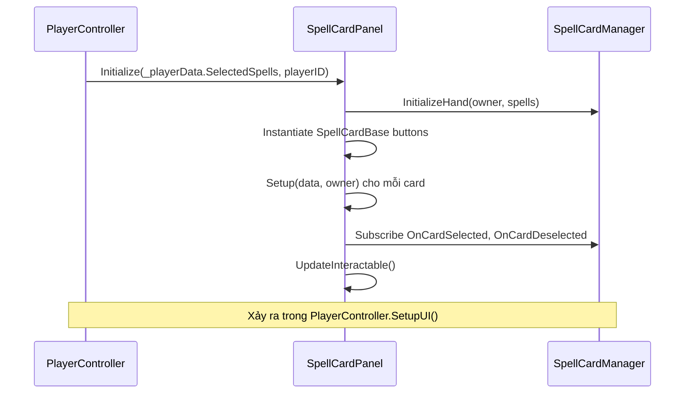
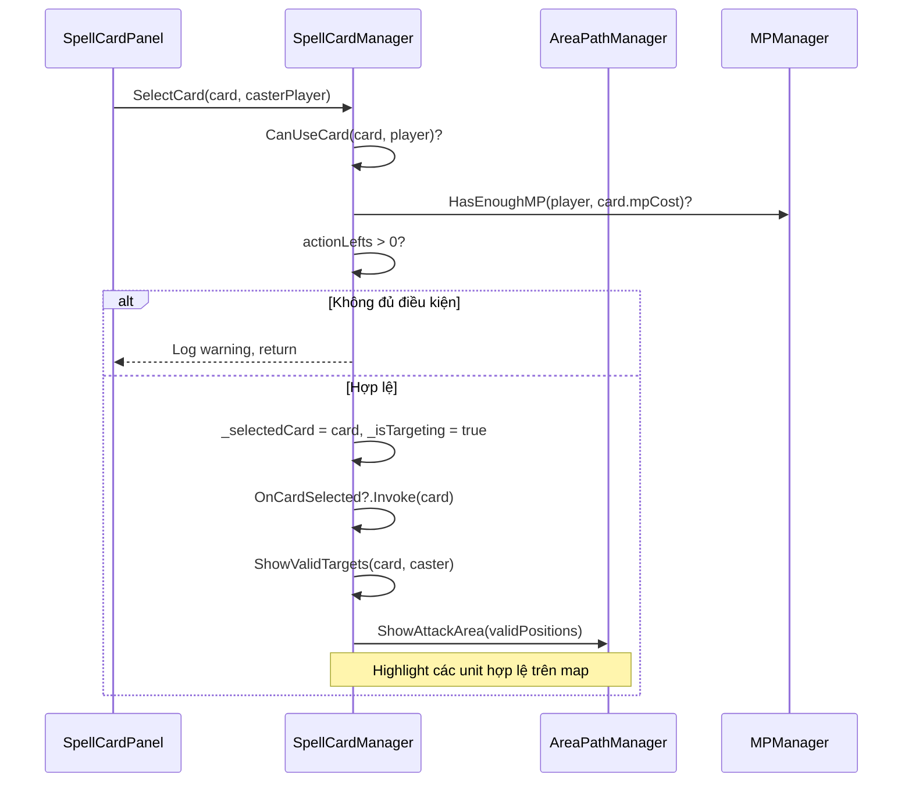
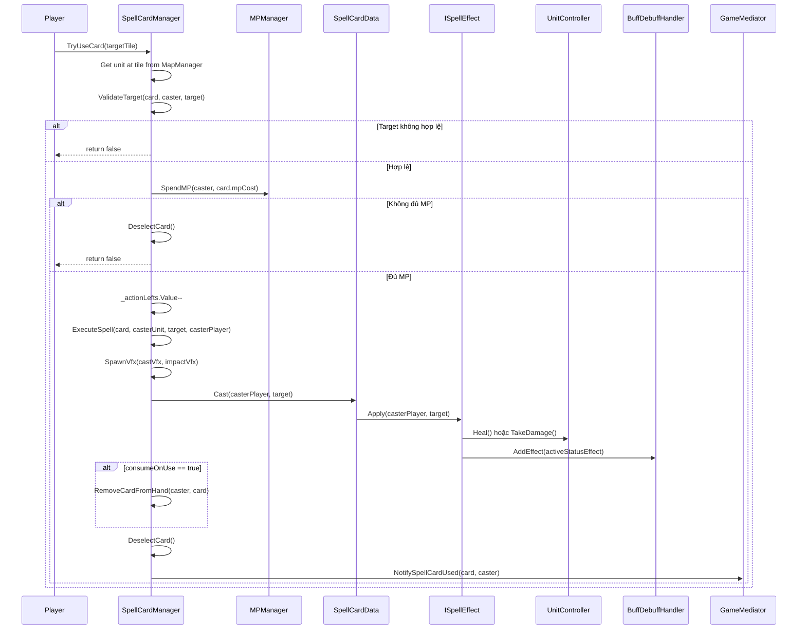
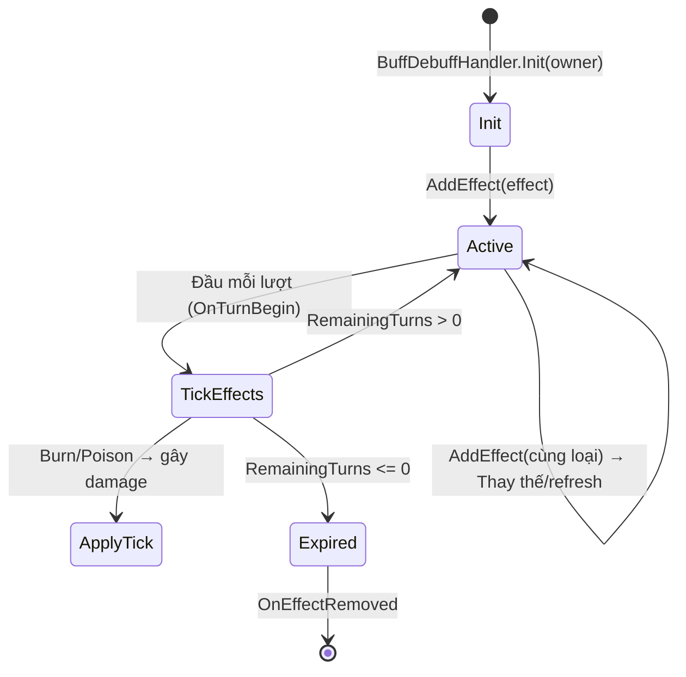
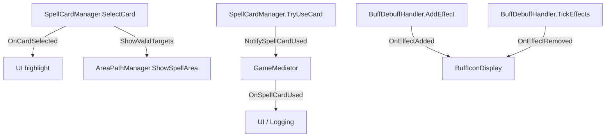

# Spell Card System Documentation

## 📋 Tổng quan

Hệ thống Spell Card cho phép player sử dụng phép thuật hỗ trợ trong trận đấu Turn-Based. Mỗi spell là một ScriptableObject (data-driven), được quản lý runtime bởi `SpellCardManager`, hiển thị qua `SpellCardPanel`, và áp dụng hiệu ứng buff/debuff lên unit thông qua `BuffDebuffHandler`.

### Phiên bản
- **Version**: 2.0
- **Last Updated**: 2026-03-24

---

## 🏗️ Kiến trúc hệ thống

### Sơ đồ tổng quan

```
┌──────────────────────────────────────────────────────────────────┐
│                        GAME MEDIATOR                             │
│              (Mediator Pattern - Event Bus)                      │
│   OnSpellCardUsed ─── NotifySpellCardUsed()                     │
│   OnHandChanged   ─── NotifyHandChanged()                       │
└────────────┬─────────────────────────────────────────────────────┘
             │
             ▼
┌──────────────────┐
│SpellCardManager  │
│(Singleton)       │
└──────┬───────────┘
       │
  ┌────┴─────┬─────────────────┐
  ▼          ▼                 ▼
┌────────┐ ┌───────────────┐ ┌──────────────────┐
│SpellCard│ │ISpellEffect   │ │  SpellCardPanel   │
│Data    │ │(SerializeRef) │ │  (UI)             │
│(SO)    │ │               │ └────────┬─────────┘
└────────┘ └───────┬───────┘          │
                   │            ┌─────┴─────┐
           ┌───────┼───────┬───┤SpellCardBase│
           ▼       ▼       ▼   │(CardUI)     │
        ┌─────┐ ┌─────┐ ┌─────┐└───────────┘
        │Heal │ │Shield│ │Dmg  │
        │Effect│ │Effect│ │Buff │
        └──┬──┘ └──┬──┘ └──┬──┘
           │       │       │
    ┌──────┼───────┼───────┼──────┐
    ▼      ▼       ▼       ▼      ▼
 ┌─────┐┌─────┐┌──────┐┌──────┐┌─────┐
 │Root ││Dmg  ││Clean ││Burn  ││Pois │
 │Effct││Effct││se    ││(tick)││on   │
 └──┬──┘└──┬──┘└──┬───┘└──┬───┘└──┬──┘
    │      │      │       │       │
    ▼      ▼      ▼       ▼       ▼
┌──────────────────────────────────────┐
│       BuffDebuffHandler              │
│  (Component on Unit, StatusEffects)  │
└──────────────────┬───────────────────┘
                   │
                   ▼
┌──────────────────────────────────────┐
│         BuffIconDisplay              │
│      (UI trên đầu unit)             │
└──────────────────────────────────────┘
```

### Core Components

| Component | Pattern | Trách nhiệm |
|-----------|---------|-------------|
| **SpellCardData** | ScriptableObject | Định nghĩa data cho spell (tên, cost, target, effect reference) |
| **SpellCardManager** | Singleton | Runtime logic: chọn card, validate target, trừ MP, kích hoạt effect |
| **SpellCardPanel** | — | UI hiển thị danh sách spell card khả dụng |
| **SpellCardBase** | — | UI component cho từng card button (kế thừa CardUI) |
| **ISpellEffect** | Strategy (SerializeReference) | Interface cho các hiệu ứng spell, được gán trực tiếp trên SO |
| **BuffDebuffHandler** | Component | Quản lý status effects (buff/debuff) trên từng unit |
| **BuffIconDisplay** | Observer | Hiển thị icon buff trên đầu unit |
| **SpellEffectSelectorDrawer** | Editor | Custom PropertyDrawer cho dropdown chọn ISpellEffect trong Inspector |

---

## 📦 Data Layer

### SpellCardData (ScriptableObject)

Mỗi spell card được định nghĩa bằng 1 ScriptableObject asset. Tạo spell mới chỉ cần tạo asset, không sửa code. Effect được gán trực tiếp trên SO thông qua `[SerializeReference]` + custom dropdown.

```csharp
[CreateAssetMenu(fileName = "NewSpellCard", menuName = "TurnBased/Spell Card")]
public class SpellCardData : ScriptableObject
{
    // Basic Info
    public string spellName = "Unnamed Spell";
    [TextArea(2, 4)] public string description;
    public Sprite icon;

    // Cost & Restrictions
    [Range(1, 10)] public int mpCost = 2;    // Chi phí MP
    public bool consumeOnUse = true;          // true = card bị xóa sau khi dùng

    // Targeting
    public SpellTargetType targetType = SpellTargetType.SingleAlly;
    [Range(0, 10)] public int range = 3;      // Tầm sử dụng

    // Effect (polymorphic - chọn loại effect trong Inspector dropdown)
    [SerializeReference, SpellEffectSelector]
    public ISpellEffect spellEffect;           // HealEffect, ShieldEffect, DamageBuffEffect, ...

    // Visual
    public GameObject castVfxPrefab;           // VFX khi cast
    public GameObject impactVfxPrefab;         // VFX khi trúng target

    // Execute spell
    public void Cast(PlayerID caster, UnitController target)
    {
        spellEffect?.Apply(caster, target);
    }
}
```

> **Thay đổi lớn so với v1:** Không còn `effectType/effectValue/effectDuration`. Thay vào đó, `ISpellEffect spellEffect` là reference polymorphic — mỗi loại effect tự chứa dữ liệu riêng (ví dụ `HealEffect.healAmount`, `ShieldEffect.shieldValue + duration`).

### SpellEffectSelector (Editor)

Custom attribute + PropertyDrawer cho phép chọn loại `ISpellEffect` qua dropdown trong Inspector:

```csharp
// Attribute
public class SpellEffectSelectorAttribute : PropertyAttribute { }

// PropertyDrawer (Editor)
[CustomPropertyDrawer(typeof(SpellEffectSelectorAttribute))]
public class SpellEffectSelectorDrawer : PropertyDrawer
{
    // Sử dụng reflection tìm tất cả class implement ISpellEffect
    // Hiển thị dropdown + inline parameters cho effect đã chọn
}
```

### Enums

```csharp
public enum SpellTargetType
{
    SingleAlly,    // 1 đồng minh
    SingleEnemy,   // 1 kẻ địch
    Self,          // Bản thân
    AllAllies,     // Tất cả đồng minh
    AllEnemies,    // Tất cả kẻ địch
    AnyUnit        // Bất kỳ unit nào
}

// Enum hợp nhất cho cả buff và debuff
public enum StatusEffectType
{
    None,
    // Buffs
    Heal,          // Hồi HP (tức thời)
    Shield,        // Giảm sát thương nhận
    DamageBuff,    // Tăng sát thương
    Cleanse,       // Xóa tất cả effects
    // Debuffs
    Burn,          // Đốt (damage mỗi lượt)
    Poison,        // Độc (damage scaling mỗi lượt)
    Slow,          // Chậm
    Weaken,        // Yếu
    Root,          // Cấm di chuyển
}

// Extension methods
public static class StatusEffectTypeExtensions
{
    public static bool IsDebuff(this StatusEffectType type)
        => type is Burn or Poison or Slow or Weaken or Root;
    public static bool IsBuff(this StatusEffectType type)
        => !type.IsDebuff() && type != StatusEffectType.None;
}
```

> **Thay đổi so với v1:** `BuffType` và `DebuffType` đã hợp nhất thành `StatusEffectType` duy nhất.

---

## 🔄 Luồng Logic Chính

### 1. Khởi tạo (Initialization)



**Chi tiết:**

1. `PlayerController.SetupUI()` gọi `SpellCardPanel.Initialize(selectedSpells, playerID)`.
2. `SpellCardPanel` gọi `SpellCardManager.InitializeHand(owner, spells)` để lưu hand.
3. Với mỗi spell trong list, Instantiate 1 `SpellCardBase` button, gọi `Setup(data, owner)` để gán tên, mô tả, cost, owner.
4. Subscribe vào `SpellCardManager.OnCardSelected` và `OnCardDeselected`.
5. Gọi `UpdateInteractable()` cập nhật trạng thái interactable.

**SpellCardManager khởi tạo hand:**
```csharp
SpellCardManager.Instance.InitializeHand(player, spells);
// → Lưu vào _playerHands[player]
```

---

### 2. Chọn Spell Card (Card Selection)



**Validation trong `CanUseCard()`:**
```
1. card != null
2. MPManager.HasEnoughMP(player, card.mpCost) == true
3. _actionLefts.Value > 0
```

**ShowValidTargets():** Lọc tất cả unit trên map, kiểm tra `ValidateTarget()`, thu thập vị trí hợp lệ, gọi `AreaPathManager.ShowAttackArea()` để highlight.

**Hủy chọn:** `DeselectCard()` → reset state, ẩn attack area, invoke `OnCardDeselected`.

---

### 3. Sử dụng Spell Card (Card Execution)



**Thứ tự xử lý trong `TryUseCard(TileEntity target)`:**

| Bước | Hành động | Chi tiết |
|------|-----------|----------|
| 1 | Kiểm tra trạng thái | `_isTargeting && _selectedCard != null` |
| 2 | Lấy unit từ tile | `MapManager.Instance.GetUnitAtTile(tile.Position)` |
| 3 | Validate target | `ValidateTarget()` theo `SpellTargetType` |
| 4 | Trừ MP | `MPManager.Instance.SpendMP()` |
| 5 | Trừ action | `_actionLefts.Value--` |
| 6 | Execute effect | `ExecuteSpell()` → `card.Cast(caster, target)` → `effect.Apply()` |
| 7 | Xóa card (nếu consumeOnUse) | `RemoveCardFromHand()` |
| 8 | Deselect | Reset targeting state |
| 9 | Trigger events | `GameMediator.NotifySpellCardUsed(card, caster)` |

> **Thay đổi so với v1:** `TryUseCard` nhận `TileEntity` thay vì `UnitController`. SpellCardManager tự lấy unit từ MapManager. Gọi `SpellCardData.Cast()` thay vì Factory pattern.

---

### 4. Target Validation

```csharp
private bool ValidateTarget(SpellCardData card, PlayerID caster, UnitController target)
{
    if (target == null || target.IsDead()) return false;

    bool isFriendly = target.GetOwner() == caster;

    return card.targetType switch
    {
        SpellTargetType.SingleAlly  => isFriendly,
        SpellTargetType.SingleEnemy => !isFriendly,
        SpellTargetType.Self        => isFriendly,
        SpellTargetType.AnyUnit     => true,
        _ => false
    };
}
```

| TargetType | Điều kiện |
|------------|-----------|
| SingleAlly | target cùng owner với caster |
| SingleEnemy | target khác owner |
| Self | target cùng owner |
| AnyUnit | luôn hợp lệ (trừ dead) |
| AllAllies / AllEnemies | chưa implement validate |

---

## ⚡ Effect System (Strategy Pattern + SerializeReference)

### ISpellEffect Interface

```csharp
public interface ISpellEffect
{
    void Apply(PlayerID caster, UnitController target);
}
```

> **Thay đổi so với v1:** Interface đơn giản hơn — không nhận `SpellCardData`. Mỗi effect class tự chứa dữ liệu cần thiết (configurable trong Inspector qua `[SerializeReference]`).

### Abstract Base (optional)

```csharp
[Serializable]
public abstract class SpellBuffEffct : ISpellEffect
{
    public abstract void Apply(PlayerID caster, UnitController target);
}
```

### Các Effect hiện có

#### HealEffect ✅
- **Mô tả:** Hồi HP cho target
- **Fields:** `[Range(1, 200)] int healAmount = 20`
- **Logic:** Gọi `target.Heal(healAmount)`
- **Điều kiện:** Target chưa chết và chưa đầy máu (`GetHealthPercent() < 1f`)
- **Không tạo buff:** Hiệu ứng tức thời

#### ShieldEffect ✅
- **Mô tả:** Tạo buff Shield giảm sát thương nhận
- **Fields:** `[Range(1, 100)] int shieldValue = 20`, `[Range(1, 10)] int duration = 2`
- **Logic:** Tạo `ActiveStatusEffect(Shield, shieldValue, duration, caster)` → `BuffDebuffHandler.AddEffect()`
- **Cơ chế:** Shield value được trừ trực tiếp vào raw damage thông qua `ModifyIncomingDamage()`
- **Duration:** Có thời hạn, giảm mỗi lượt

#### DamageBuffEffect ✅
- **Mô tả:** Tăng sát thương cho đồng minh
- **Fields:** `[Range(1, 100)] int damageBonus = 20`, `[Range(1, 10)] int duration = 2`
- **Logic:** Tạo `ActiveStatusEffect(DamageBuff, damageBonus, duration, caster)` → `BuffDebuffHandler.AddEffect()`
- **Cơ chế:** Bonus damage được lấy qua `GetDamageBonus()`
- **Duration:** Có thời hạn

#### CleanseEffect ✅
- **Mô tả:** Xóa toàn bộ buff/debuff trên target
- **Fields:** Không có
- **Logic:** Gọi `BuffDebuffHandler.ClearAll()`
- **Trạng thái:** Đã hoàn thiện

#### RootEffect ✅
- **Mô tả:** Cấm di chuyển trong N lượt
- **Fields:** `[Range(1, 5)] int duration = 2`
- **Logic:** Tạo `ActiveStatusEffect(Root, 0, duration, caster)` → `BuffDebuffHandler.AddEffect()`
- **Cơ chế:** `UnitController.CanMove()` kiểm tra `BuffDebuffHandler.IsRooted()` → trả false nếu bị Root
- **Trạng thái:** Đã hoàn thiện

#### DamageEffect ✅ (MỚI)
- **Mô tả:** Gây sát thương trực tiếp lên target
- **Fields:** `int damage = 2`
- **Logic:** Gọi `target.TakeDamage(damage)`
- **Không tạo buff:** Hiệu ứng tức thời

### Class Diagram

```
        ISpellEffect
        (interface)
            │
     ┌──────┼──────┬──────────┬──────────┬──────────┐
     ▼      ▼      ▼          ▼          ▼          ▼
   Heal   Shield  DamageBuff Cleanse    Root     Damage
   Effect  Effect  Effect     Effect    Effect   Effect
```

> **Workflow thêm Effect mới:**
> 1. Tạo class `[Serializable]` implement `ISpellEffect`
> 2. Thêm fields cần thiết (tự động hiện trong Inspector dropdown)
> 3. Không cần sửa Factory hay switch statement

---

## 🛡️ Buff/Debuff System

### ActiveStatusEffect

Đại diện cho 1 status effect đang active trên unit (struct inside `BuffDebuffHandler`):

```csharp
public struct ActiveStatusEffect
{
    public StatusEffectType Type { get; }
    public int Value { get; }                    // Damage, shield amount, bonus, etc.
    public int RemainingTurns { get; private set; }
    public PlayerID SourcePlayer { get; }

    // Giảm 1 turn, return true nếu hết hạn
    public bool TickTurn()
    {
        RemainingTurns--;
        return RemainingTurns <= 0;
    }
}
```

> **Thay đổi so với v1:** Đổi tên từ `ActiveBuff` → `ActiveStatusEffect`. Là `struct` (value type) thay vì `class`.

### BuffDebuffHandler (Component trên Unit)

Mỗi unit có 1 `BuffDebuffHandler` quản lý toàn bộ status effects (buff + debuff).

#### Lifecycle



#### Các method chính

| Method | Chức năng |
|--------|-----------|
| `Init(owner)` | Khởi tạo, clear effects cũ |
| `AddEffect(effect)` | Thêm effect (cùng loại → thay thế/refresh) |
| `ApplyTickEffects(effect)` | Áp dụng damage mỗi lượt (Burn, Poison) |
| `TickEffects()` | Giảm duration mỗi lượt, apply tick effects, xóa hết hạn |
| `GetShieldValue()` | Tổng giáp bonus từ Shield effects |
| `GetDamageBonus()` | Tổng damage bonus từ DamageBuff effects |
| `IsRooted()` | Kiểm tra bị Root → chặn di chuyển |
| `GetBuffs()` | Lấy tất cả buff effects |
| `GetDebuffs()` | Lấy tất cả debuff effects |
| `HasEffect(type)` | Kiểm tra có effect loại X |
| `RemoveByType(type)` | Xóa tất cả effects loại X |
| `ClearAll()` | Xóa toàn bộ effects |
| `ModifyIncomingDamage(raw)` | Tính sát thương sau Shield: `max(0, raw - shield)` |

#### Events

| Event | Trigger |
|-------|---------|
| `OnEffectAdded(ActiveStatusEffect)` | Khi effect mới được add |
| `OnEffectRemoved(ActiveStatusEffect)` | Khi effect bị xóa hoặc hết hạn |

#### Quy tắc status effects

- **Cùng loại → thay thế:** Khi add effect cùng `StatusEffectType`, effect cũ bị xóa, effect mới thay thế.
- **Khác loại → stack:** Có thể có nhiều loại effect khác nhau đồng thời.
- **Tick mỗi lượt:** `TickEffects()` gọi ở đầu turn (từ `UnitController.OnTurnBegin()`) → giảm `RemainingTurns` → apply tick damage (Burn/Poison) → xóa nếu hết.
- **Burn:** Gây damage cố định mỗi lượt.
- **Poison:** Gây damage scaling mỗi lượt.

### Tích hợp với UnitController

```csharp
// Trong UnitController
public void TakeDamage(float damage)
{
    if (damage > 0 && _buffHandler != null)
        damage = _buffHandler.ModifyIncomingDamage(damage); // Shield giảm damage
    // ... xử lý damage, update HP bar
}

public bool CanMove()
{
    if (_buffHandler != null && _buffHandler.IsRooted()) return false;
    return !runtimeStats.IsMoveCompleted && !runtimeStats.IsInAttackMode;
}

public void OnTurnBegin()
{
    _attackComponent.ReduceSkillsCooldowns();
    _buffHandler?.TickEffects(); // Áp dụng tick effects + giảm duration
    ResetComponents();
}
```

---

## 🎨 UI Layer

### CardUI (Base Class)

```csharp
public class CardUI : MonoBehaviour, IPointerClickHandler
{
    public TextMeshProUGUI titleText;   // Tên spell
    public TextMeshProUGUI descText;    // Mô tả
    public TextMeshProUGUI costText;    // Chi phí MP
    public Image costBg;                // Nền cost

    public virtual void Setup(SpellCardData data);
    public virtual void OnPointerClick(PointerEventData eventData);
}
```

### SpellCardBase (kế thừa CardUI)

```csharp
public class SpellCardBase : CardUI
{
    [SerializeField] protected SpellCardData spellData;
    private PlayerID _ownerPlayer;
    private Button _button;
    
    public SpellCardData Data => spellData;

    public void Setup(SpellCardData data, PlayerID owner);  // Gán data + owner
    public override void Setup(SpellCardData data);          // Defaults to Player1
    public override void OnPointerClick(PointerEventData eventData);  
        // → SpellCardManager.Instance.SelectCard(spellData, _ownerPlayer)
    public void SetInteractable(bool interactable);
}
```

**Setup():**
- `titleText` ← `data.spellName`
- `descText` ← `data.description`
- `costText` ← `data.mpCost.ToString()`
- `costBg` ← `Color.blue`
- `_ownerPlayer` ← `owner`

### SpellCardPanel

```csharp
public class SpellCardPanel : MonoBehaviour
{
    [SerializeField] Transform _cardContainer;
    [SerializeField] SpellCardBase _cardButtonPrefab;
    [SerializeField] IntReference _actionLefts;
    private readonly List<SpellCardBase> _spells = new();
    private PlayerID _ownerPlayer;
    
    public void Initialize(IReadOnlyList<SpellCardData> spells, PlayerID owner);
    public void Initialize(IReadOnlyList<SpellCardData> spells);  // Default Player1
    public void UpdateInteractable();    // Enable/disable theo CanUseCard()
    private void RebuildFromHand();      // Rebuild UI từ current hand
    private void ClearButtons();         // Destroy tất cả buttons
    private void OnHandChanged(PlayerID player);  // Rebuild khi hand thay đổi
    private void OnCardUsed(SpellCardData card, PlayerID caster);  // Update interactable
}
```

**Flow:**
1. `Initialize()` → `SpellCardManager.InitializeHand()` + Instantiate buttons + Subscribe events
2. Khi hand thay đổi → `OnHandChanged()` → `RebuildFromHand()`
3. Khi card used → `OnCardUsed()` → `UpdateInteractable()`

### BuffIconDisplay

```csharp
public class BuffIconDisplay : MonoBehaviour
{
    [SerializeField] Transform _iconContainer;
    [SerializeField] GameObject _buffIconPrefab;
    [SerializeField] BuffDebuffHandler _handler;
    [SerializeField] Sprite shieldIcon, rootIcon, healIcon, damageBuffIcon;
    private readonly Dictionary<StatusEffectType, GameObject> _activeIcons = new();
}
```

- Subscribe `OnEffectAdded` / `OnEffectRemoved` của `BuffDebuffHandler`.
- Khi effect added → Instantiate icon prefab vào container.
- Khi effect removed → Destroy icon object.
- Map `StatusEffectType` → Sprite icon (Shield, Root, Heal, DamageBuff).

---

## 📡 Event System

### Events Flow



### Event Table

| Source | Event | Parameters | Subscribers |
|--------|-------|-----------|-------------|
| SpellCardManager | `OnCardSelected` | SpellCardData | SpellCardPanel (highlight) |
| SpellCardManager | `OnCardDeselected` | — | SpellCardPanel (reset) |
| GameMediator | `OnSpellCardUsed` | SpellCardData, PlayerID | SpellCardPanel, UI |
| GameMediator | `OnHandChanged` | PlayerID | SpellCardPanel (rebuild) |
| BuffDebuffHandler | `OnEffectAdded` | ActiveStatusEffect | BuffIconDisplay |
| BuffDebuffHandler | `OnEffectRemoved` | ActiveStatusEffect | BuffIconDisplay |

> **Thay đổi so với v1:** Không còn `SpellCardEventBus`. Tất cả cross-system events đi qua `GameMediator`. `SpellCardManager` chỉ giữ local events (`OnCardSelected`, `OnCardDeselected`).

---

## 🔗 Integration Points

### 1. PlayerController → SpellCardPanel

```csharp
// PlayerController.SetupUI()
_spellCardPanel.Initialize(_playerData.SelectedSpells, playerID);
```

Player data chứa danh sách spell đã chọn trước trận → truyền vào panel kèm playerID để render UI.

### 2. SpellCardManager → MPManager

```csharp
// Kiểm tra đủ MP
MPManager.Instance.HasEnoughMP(player, card.mpCost);
// Trừ MP khi dùng
MPManager.Instance.SpendMP(caster, card.mpCost);
```

### 3. SpellCardManager → AreaPathManager

```csharp
// Hiển thị vùng target khi chọn card (spell area riêng)
AreaPathManager.Instance?.ShowSpellArea(validPositions);
// Ẩn khi deselect
AreaPathManager.Instance?.HideSpellArea();
```

### 4. SpellCardManager → GameMediator

```csharp
// Thông báo spell đã được dùng
GameMediator.Instance?.NotifySpellCardUsed(usedCard, caster);
```

### 5. SpellCardData → ISpellEffect → BuffDebuffHandler

```csharp
// SpellCardData.Cast() → ISpellEffect.Apply()
card.Cast(casterPlayer, target);
// Trong các effect cần buff:
var handler = target.GetComponent<BuffDebuffHandler>();
handler.AddEffect(new ActiveStatusEffect(type, value, duration, caster));
```

### 6. BuffDebuffHandler → UnitController (Damage + Movement)

```csharp
// Shield giảm damage
damage = _buffHandler.ModifyIncomingDamage(damage);
// Root chặn di chuyển
if (_buffHandler.IsRooted()) return false;
```

### 7. PlayerDataSO → SpellCardPanel

```csharp
public class PlayerDataSO : ScriptableObject
{
    [SerializeField] private List<SpellCardData> _ownedSpells = new();
    [SerializeField] private List<SpellCardData> _selectedSpells = new(); // max 4
    public IReadOnlyList<SpellCardData> SelectedSpells { get; }
    public bool AddSelectedSpell(SpellCardData spell);  // max 4
}
```

---

## 🎨 Design Patterns

### 1. Strategy Pattern — Spell Effects (via SerializeReference)

Mỗi loại effect implement `ISpellEffect` và được gán trực tiếp trên `SpellCardData` qua `[SerializeReference]`. Thêm spell mới chỉ cần:
1. Tạo class `[Serializable]` implement `ISpellEffect`
2. Tự động xuất hiện trong dropdown Inspector
3. **Không cần Factory, không cần sửa switch/enum**

### 2. Observer Pattern — Events

- `SpellCardManager`: local events cho UI (`OnCardSelected`, `OnCardDeselected`)
- `BuffDebuffHandler`: events cho visual feedback (`OnEffectAdded`, `OnEffectRemoved`)
- `GameMediator`: event bus trung tâm (`OnSpellCardUsed`, `OnHandChanged`)

### 3. Singleton Pattern — Managers

`SpellCardManager.Instance` đảm bảo 1 instance duy nhất, truy cập global.

### 4. Data-Driven — ScriptableObject + SerializeReference

`SpellCardData` là ScriptableObject. `ISpellEffect` gán polymorphic → tạo spell mới hoàn toàn trong Unity Editor, không sửa code ngoại trừ khi cần effect logic mới.

---

## ⚠️ Trạng thái hiện tại & TODO

| Hạng mục | Trạng thái | Ghi chú |
|----------|-----------|---------|
| SpellCardData (SO) | ✅ Hoàn thiện | Data-driven, SerializeReference cho effect |
| SpellCardManager (logic) | ✅ Hoàn thiện | Select, validate, execute, hand management |
| SpellEffects (Heal, Shield, DamageBuff) | ✅ Hoàn thiện | Tức thời + buff có duration |
| DamageEffect | ✅ Hoàn thiện | Gây sát thương trực tiếp |
| CleanseEffect | ✅ Hoàn thiện | Gọi ClearAll() xóa toàn bộ effects |
| RootEffect | ✅ Hoàn thiện | Cấm di chuyển, tích hợp CanMove() |
| SpellCardPanel UI | ✅ Hoàn thiện | Initialize, UpdateInteractable, RebuildFromHand, ClearButtons |
| BuffDebuffHandler | ✅ Hoàn thiện | Add, tick, remove, damage modification, tick effects (Burn/Poison) |
| BuffIconDisplay | ✅ Hoàn thiện | Auto update icon khi effect thay đổi |
| Dynamic Player ID trong Panel | ✅ Hoàn thiện | Nhận playerID từ PlayerController |
| AllAllies / AllEnemies targeting | ⚠️ Chưa implement validate | `IsMultiTarget()` check có nhưng logic chưa đầy đủ |
| Burn/Poison tick effects | ✅ Hoàn thiện | ApplyTickEffects() xử lý damage mỗi lượt |
| Slow/Weaken debuffs | ⚠️ Enum có, logic chưa tích hợp | StatusEffectType có nhưng chưa có gameplay effect |
